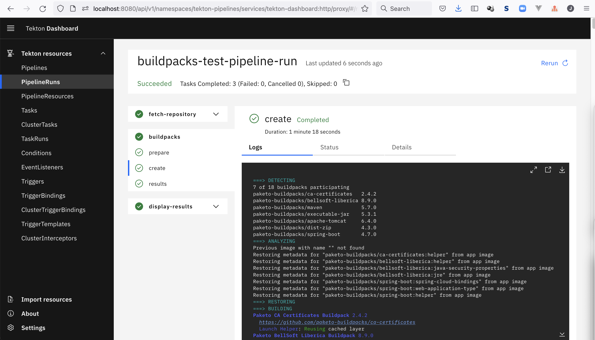

# pulumi-eks-tekton
[](https://github.com/jonashackt/pulumi-eks-tekton/actions)

This Demo repository will deploy and configure a Tekton CI System with Flux on Amazon EKS.


# EKS with Pulumi

Let's simply roll out a AWS EKS cluster with Pulumi:

https://www.pulumi.com/docs/guides/crosswalk/aws/eks/

Our [eks-deployment/index.ts](eks-deployment/index.ts) looks like this:

```typescript
import * as eks from "@pulumi/eks";

// Create an EKS cluster with the default configuration.
const cluster = new eks.Cluster("eks-for-tekton");

// Export the cluster's kubeconfig.
export const kubeconfig = cluster.kubeconfig;
export const eksUrl = cluster.eksCluster.endpoint;
```

To execute our Pulumi program, be sure to be logged into the correct Account at https://app.pulumi.com/your-account-here via `pulumi login` using your Pulumi account's token (do a `pulumi logout` before, if you're already logged into another Pulumi account).

Now select the correct stack and fire up Pulumi with:

```shell
pulumi stack select dev
pulumi up
```

### Accessing the Pulumi created EKS cluster

After your EKS cluster has been setup correctly, use the `kubeconfig` const exported inside our Pulumi program to create the `kubeconfig.yml`:

```shell
pulumi stack output kubeconfig > kubeconfig.yml
```

To access the cluster be sure to have `kubectl` installed. Try accessing it with:

```shell
kubectl --kubeconfig kubeconfig.yml get nodes
```

For merging the new kubeconfig into your systems profile see https://kubernetes.io/docs/concepts/configuration/organize-cluster-access-kubeconfig/

For example you could do:

```shell
pulumi stack output kubeconfig > ~/.kube/config-eks-for-tekton
export KUBECONFIG=~/.kube/config:~/.kube/config-eks-for-tekton
```

Now access via `kubectx` is also possible.


### GitHub Actions using Pulumi to provision AWS EKS

First we need to create GitHub repository secrets containing our AWS API key id & access key (`AWS_ACCESS_KEY_ID` & `AWS_SECRET_ACCESS_KEY`) and our Pulumi access token (`PULUMI_ACCESS_TOKEN`):


Our [provision.yml](.github/workflows/provision.yml) workflow uses Pulumi like we did locally:

```yaml
name: provision

on: [push]

jobs:
  provision-aws-eks:
    runs-on: ubuntu-latest
    env:
      AWS_ACCESS_KEY_ID: ${{ secrets.AWS_ACCESS_KEY_ID }}
      AWS_SECRET_ACCESS_KEY: ${{ secrets.AWS_SECRET_ACCESS_KEY }}
      PULUMI_ACCESS_TOKEN: ${{ secrets.PULUMI_ACCESS_TOKEN }}
      AWS_DEFAULT_REGION: 'eu-central-1'
    # Create an GitHub environment referencing our EKS cluster endpoint
    environment:
      name: tekton-flux-eks-pulumi-dev
      url: ${{ steps.pulumi-up.outputs.eks_url }}
    steps:
      - name: Checkout
        uses: actions/checkout@master

      - name: Setup node env
        uses: actions/setup-node@v2.4.1
        with:
          node-version: '14'

      - name: Cache node_modules
        uses: actions/cache@v2
        with:
          path: ~/.npm
          key: ${{ runner.os }}-node-${{ hashFiles('**/package-lock.json') }}
          restore-keys: |
            ${{ runner.os }}-node-

      - name: Install Pulumi dependencies before npm run generate to prevent it from breaking the build
        run: npm install
        working-directory: ./eks-deployment

      - name: Install Pulumi CLI
        uses: pulumi/action-install-pulumi-cli@v2.0.0

      - name: Provision AWS EKS cluster with Pulumi
        id: pulumi-up
        run: |
          pulumi stack select dev
          pulumi preview
          echo "lets use --suppress-outputs here in order to prevent Pulumi from logging the kubeconfig into public GitHub Action logs"
          pulumi up --yes --suppress-outputs
          pulumi stack output kubeconfig > kubeconfig.yml
          echo "::set-output name=eks_url::$(pulumi stack output eksUrl)/api/hello"
        working-directory: ./eks-deployment

      - name: Try to connect to our EKS cluster using kubectl
        run: kubectl --kubeconfig kubeconfig.yml get nodes
        working-directory: ./eks-deployment


```

Mind to use `--suppress-outputs` flag for our `pulumi up` to prevent the `kubeconfig` from getting logged unmasked. 

We also export our `eks endpoint url` as an GitHub Environment ([as described here](https://stackoverflow.com/a/67385569/4964553)).


#### Prevent the ' getting credentials: exec: executable aws failed with exit code 255' error

I got this error ([see log](https://github.com/jonashackt/tekton-flux-eks-pulumi/runs/4105712645?check_suite_focus=true)): 

```
...
<botocore.awsrequest.AWSRequest object at 0x7f067c580670>
Unable to connect to the server: getting credentials: exec: executable aws failed with exit code 255
Error: Process completed with exit code 1.
```

Luckily this answer brought me into the right direction: https://stackoverflow.com/a/59184490/4964553

I needed to define the `AWS_DEFAULT_REGION: 'eu-central-1'` also solely for `kubectl` in GitHub Actions. With this the error was gone, since the other two variables for `aws-cli` (which is already installed in the GitHub Actions virtual environment) were defined properly. 


# Install Tekton on EKS

https://tekton.dev/docs/getting-started/

Buildpacks: https://buildpacks.io/docs/tools/tekton/


### Tekton Pipelines

https://tekton.dev/docs/getting-started/#installation

So let's add the installation and wait for Tekton to become available:

```yaml
...
      - name: Install Tekton Pipelines
        run: kubectl apply --filename https://storage.googleapis.com/tekton-releases/pipeline/latest/release.yaml

      - name: Wait for Tekton to become ready & show running Tekton pods
        run: |
          kubectl wait --for=condition=ready pod -l app=tekton-pipelines-controller --namespace tekton-pipelines
          kubectl get pods --namespace tekton-pipelines
```

### Persistent Volumes (Optional)

https://tekton.dev/docs/getting-started/#persistent-volumes

Let's check if our EKS cluster [already has a `StorageClass` defined](https://docs.aws.amazon.com/eks/latest/userguide/storage-classes.html) with `kubectl get storageclasses`:

```shell
$ kubectl get storageclasses
NAME            PROVISIONER             RECLAIMPOLICY   VOLUMEBINDINGMODE      ALLOWVOLUMEEXPANSION   AGE
gp2 (default)   kubernetes.io/aws-ebs   Delete          WaitForFirstConsumer   false                  179m
```
Before creating it let's check if there is already a `ConfigMap` defined:

```shell
kubectl describe configmap config-artifact-pvc -n tekton-pipelines
```

From the docs:

> Your Kubernetes cluster, such as one from Google Kubernetes Engine, may have persistent volumes set up at the time of creation, thus no extra step is required

If there's no Persistens Volume defined, we need to create a `ConfigMap` which defines the Persistent Volume Tekton will request:

```shell
kubectl create configmap config-artifact-pvc \
                         --from-literal=size=10Gi \
                         --from-literal=storageClassName=gp2 \
                         -o yaml -n tekton-pipelines \
                         --dry-run=client | kubectl replace -f -
```


### Tekton CLI

Install the Tekton CLI e.g. via homebrew:

```shell
brew tap tektoncd/tools
brew install tektoncd/tools/tektoncd-cli
```

### Run first Tekton Task

See the [task-hello-world.yaml](tekton-ci-config/task-hello-world.yaml):

```yaml
apiVersion: tekton.dev/v1beta1
kind: Task
metadata:
  name: hello
spec:
  steps:
    - name: hello
      image: ubuntu
      command:
        - echo
      args:
        - "Hello World!"
```

Let's apply it to our cluster:

```shell
kubectl apply -f tekton-ci-config/task-hello-world.yaml
```

Let's show our newly created task:

```shell
$ tkn task list
NAMESPACE   NAME    DESCRIPTION   AGE
default     hello                 24 seconds ago
```

Now this is only a Tekton Task definition. We need another Tekton object - the `TaskRun` - in order to run our Task. Create it with:

```shell
tkn task start hello
```

Follow the logs of the TaskRun with:

```shell
tkn taskrun logs --last -f 
```


### Tekton Dashboard

https://tekton.dev/docs/dashboard/

Install it with:

```shell
kubectl apply --filename https://github.com/tektoncd/dashboard/releases/latest/download/tekton-dashboard-release.yaml
```

Now as we already ran some Tasks let's have a look into the Tekton dashboard:

```shell
kubectl proxy --port=8080
```

Then open your Browser at http://localhost:8080/api/v1/namespaces/tekton-pipelines/services/tekton-dashboard:http/proxy/


#### Expose Tekton Dashboard publicly on EKS

The ultra simple (but only PoC grade) solution to expose an public endpoint on a Cloud Provider's managed K8s is to use a `Service` with type `LoadBalancer`. As the docs state (https://kubernetes.io/docs/concepts/services-networking/service/#loadbalancer):

> On cloud providers which support external load balancers, setting the type field to LoadBalancer provisions a load balancer for your Service. The actual creation of the load balancer happens asynchronously, and information about the provisioned balancer is published in the Service's .status.loadBalancer field.

And also the AWS EKS docs state this (https://docs.aws.amazon.com/eks/latest/userguide/network-load-balancing.html):

> When you create a Kubernetes Service of type LoadBalancer, an AWS Network Load Balancer (NLB) is provisioned that load balances network traffic.


##### Service yaml

So this would be our ultra simple Service to access our Tekton Dashboard (see [tekton-dashboard-service.yml](tekton-dashboard-service.yml)):

```yaml
apiVersion: v1
kind: Service
metadata:
  name: tekton-dashboard-external-svc-manual
spec:
  selector:
    app: tekton-dashboard
  ports:
    - protocol: TCP
      port: 80
      targetPort: 9097
  type: LoadBalancer
```

But it's not that easy to simply apply it and grab the url. Have a look inside our [provision.yml](.github/workflows/provision.yml) for all commands in working order. Here are the steps:

First we `apply` our [tekton-dashboard-service.yml](tekton-dashboard-service.yml):

```yaml
kubectl apply -f tekton-dashboard-service.yml -n tekton-pipelines
```

##### Wait until AWS ELB is provisioned & populated into `status.loadBalancer.ingress[0].hostname`

Then we have to wait until our AWS ELB LoadBalancer is provisioned. [As stated](https://kubernetes.io/docs/concepts/services-networking/service/#loadbalancer) the

> ...actual creation of the load balancer happens asynchronously, and information about the provisioned balancer is published in the Service's .status.loadBalancer field.

If the LoadBalancer is readily provisioned, a `kubectl get service/tekton-dashboard-external-svc-manual --output=yaml` shows us the following:

```yaml
apiVersion: v1
kind: Service
metadata:
  annotations:
    kubectl.kubernetes.io/last-applied-configuration: |
      {"apiVersion":"v1","kind":"Service","metadata":{"annotations":{},"name":"tekton-dashboard-external-svc-manual","namespace":"tekton-pipelines"},"spec":{"ports":[{"port":80,"protocol":"TCP","targetPort":9097}],"selector":{"app":"tekton-dashboard"},"type":"LoadBalancer"}}
  creationTimestamp: "2021-11-23T09:07:27Z"
  finalizers:
  - service.kubernetes.io/load-balancer-cleanup
  name: tekton-dashboard-external-svc-manual
  namespace: tekton-pipelines
  resourceVersion: "677614"
  uid: 26431f31-0b27-4df3-a6cd-3d32f825cd5f
spec:
  clusterIP: 10.100.42.167
  clusterIPs:
  - 10.100.42.167
  externalTrafficPolicy: Cluster
  ipFamilies:
  - IPv4
  ipFamilyPolicy: SingleStack
  ports:
  - nodePort: 31306
    port: 80
    protocol: TCP
    targetPort: 9097
  selector:
    app: tekton-dashboard
  sessionAffinity: None
  type: LoadBalancer
status:
  loadBalancer:
    ingress:
    - hostname: a26431f310b274df3a6cd3d32f825cd5-1729774979.eu-central-1.elb.amazonaws.com
```

So we have to somehow wait for the field `status.loadBalancer` to contain the `ingress[0].hostname` (remember to use the list selector `[0]` here, since `hostname` is represented as list).

But since the field `ingress[0].hostname` isn't present at first, a direct access via `kubectl get service tekton-dashboard-external-svc-manual -n tekton-pipelines --output=jsonpath='{.status.loadBalancer.ingress[0].hostname}'` would result in zero results.

As `kubectl wait` [isn't capable of beeing used without `status.conditions` ](https://github.com/kubernetes/kubernetes/issues/80828#issuecomment-517555879) fields present right now (see the issue [kubectl wait on arbitrary jsonpath](https://github.com/kubernetes/kubernetes/issues/83094), the solution is beeing merged into `v1.23` (see this PR https://github.com/kubernetes/kubernetes/pull/105776)), we need to find an alternative way for now.

For a solution see this so answer https://stackoverflow.com/questions/70108499/kubectl-wait-for-service-on-aws-eks-to-expose-elastic-load-balancer-elb-addres

Therefore the answer ["watch" the output of a command until a particular string is observed and then exit](https://superuser.com/a/375331/497608) comes in handy:

```shell
until my_cmd | grep "String Im Looking For"; do : ; done
```

If we use this approach together with a `kubectl get` we can craft a command which will wait until the field `ingress` gets populated into the `status.loadBalancer` field in our Service:

```shell
until kubectl get service/tekton-dashboard-external-svc-manual -n tekton-pipelines --output=jsonpath='{.status.loadBalancer}' | grep "ingress"; do : ; done
```


##### Grab the Tekton Dashboard URL and populate as GitHub Environment

Now that our AWS ELB is provisioned we can finally grad it's URL with:

```shell
kubectl get service tekton-dashboard-external-svc-manual -n tekton-pipelines --output=jsonpath='{.status.loadBalancer.ingress[0].hostname}'
```

Then it's easy to use the output and create a GitHub step variable, which is used in the GitHub Environment definition at the top of the job:

```yaml
echo "--- Create GitHub environment var"
DASHBOARD_HOST=$(kubectl get service tekton-dashboard-external-svc-manual -n tekton-pipelines --output=jsonpath='{.status.loadBalancer.ingress[0].hostname}')
echo "The Tekton dashboard is accessible at $DASHBOARD_HOST - creating GitHub Environment"
echo "::set-output name=dashboard_host::http://$DASHBOARD_HOST"
```


### Cloud Native Buildpacks

https://buildpacks.io/docs/tools/tekton/

#### Install Tasks

Install [git clone](https://hub.tekton.dev/tekton/task/git-clone) and [buildpacks](https://hub.tekton.dev/tekton/task/buildpacks) Task:
```shell
kubectl apply -f https://raw.githubusercontent.com/tektoncd/catalog/master/task/git-clone/0.4/git-clone.yaml
kubectl apply -f https://raw.githubusercontent.com/tektoncd/catalog/master/task/buildpacks/0.3/buildpacks.yaml
```

#### Create Secret for GitLab Container Registry authorization

To access the GitLab Container Registry we need to first create a PAT or deploy token (see https://docs.gitlab.com/ee/user/packages/container_registry/#authenticate-with-the-container-registry)

Go to `Settings/Repository` inside your GitLab repo - for me this is https://gitlab.com/jonashackt/microservice-api-spring-boot/-/settings/repository

There create a token `TektonBuildpacksToken` under `Deploy tokens` with a username `gitlab-token` and `read_registry` & `write_registry` access. 

Now create GitHub Repository Secrets called `GITLAB_CR_USER` and `GITLAB_CR_PASSWORD` accordingly with the Tokens username and token.

Finally we can create our Secret inside our GitHub Actions pipeline:

https://buildpacks.io/docs/tools/tekton/#42-authorization

```shell
kubectl create secret docker-registry docker-user-pass \
    --docker-server=registry.gitlab.com \
    --docker-username=${{ secrets.GITLAB_CR_USER }} \
    --docker-password=${{ secrets.GITLAB_CR_PASSWORD }} \
    --namespace default
```

After the first successful secret creation, we sadly get the error `error: failed to create secret secrets "docker-user-pass" already exists` - which is correct, since the secret already exists.

But there's help (see https://stackoverflow.com/a/45881259/4964553): We add `--save-config --dry-run=client -o yaml | kubectl apply -f -` to our command like this:

```shell
kubectl create secret docker-registry docker-user-pass \
    --docker-server=registry.gitlab.com \
    --docker-username=${{ secrets.GITLAB_CR_USER }} \
    --docker-password=${{ secrets.GITLAB_CR_PASSWORD }} \
    --namespace default \
    --save-config --dry-run=client -o yaml | kubectl apply -f -
```

Now we made an `apply` out of our `create` kubectl command, which we can use repetitively :)


We also need to create a `ServiceAccount` that uses this secret as [ghcr-service-account.yml](tekton-ci-config/ghcr-service-account.yml)

```yaml
apiVersion: v1
kind: ServiceAccount
metadata:
  name: buildpacks-service-account
secrets:
  - name: docker-user-pass
```

#### Create buildpacks PVC 

https://buildpacks.io/docs/tools/tekton/#41-pvcs

Create new [resources.yml](tekton-ci-config/resources.yml):

```yaml
apiVersion: v1
kind: PersistentVolumeClaim
metadata:
  name: buildpacks-source-pvc
spec:
  accessModes:
    - ReadWriteOnce
  resources:
    requests:
      storage: 500Mi
```

#### Create Pipeline

Create [pipeline.yml](tekton-ci-config/pipeline.yml):

```yaml
apiVersion: tekton.dev/v1beta1
kind: Pipeline
metadata:
  name: buildpacks-test-pipeline
spec:
  params:
    - name: image
      type: string
      description: image URL to push
  workspaces:
    - name: source-workspace # Directory where application source is located. (REQUIRED)
    - name: cache-workspace # Directory where cache is stored (OPTIONAL)
  tasks:
    - name: fetch-repository # This task fetches a repository from github, using the `git-clone` task you installed
      taskRef:
        name: git-clone
      workspaces:
        - name: output
          workspace: source-workspace
      params:
        - name: url
          value: https://github.com/buildpacks/samples
        - name: subdirectory
          value: ""
        - name: deleteExisting
          value: "true"
    - name: buildpacks # This task uses the `buildpacks` task to build the application
      taskRef:
        name: buildpacks
      runAfter:
        - fetch-repository
      workspaces:
        - name: source
          workspace: source-workspace
        - name: cache
          workspace: cache-workspace
      params:
        - name: APP_IMAGE
          value: "$(params.image)"
        - name: SOURCE_SUBPATH
          value: "apps/java-maven" # This is the path within the samples repo you want to build (OPTIONAL, default: "")
        - name: BUILDER_IMAGE
          value: paketobuildpacks/builder:base # This is the builder we want the task to use (REQUIRED)
    - name: display-results
      runAfter:
        - buildpacks
      taskSpec:
        steps:
          - name: print
            image: docker.io/library/bash:5.1.4@sha256:b208215a4655538be652b2769d82e576bc4d0a2bb132144c060efc5be8c3f5d6
            script: |
              #!/usr/bin/env bash
              set -e
              echo "Digest of created app image: $(params.DIGEST)"              
        params:
          - name: DIGEST
      params:
        - name: DIGEST
          value: $(tasks.buildpacks.results.APP_IMAGE_DIGEST)
```

And now apply all three configs with:

```shell
kubectl apply -f tekton-ci-config/resources.yml -f tekton-ci-config/ghcr-service-account.yml -f tekton-ci-config/pipeline.yml
```

#### Create PipelineRun

Create [pipeline-run.yml](tekton-ci-config/pipeline-run.yml):

```yaml
apiVersion: tekton.dev/v1beta1
kind: PipelineRun
metadata:
  generateName: buildpacks-test-pipeline-run-
spec:
  serviceAccountName: buildpacks-service-account-gitlab # Only needed if you set up authorization
  pipelineRef:
    name: buildpacks-test-pipeline
  workspaces:
    - name: source-workspace
      subPath: source
      persistentVolumeClaim:
        claimName: buildpacks-source-pvc
    - name: cache-workspace
      subPath: cache
      persistentVolumeClaim:
        claimName: buildpacks-source-pvc
  params:
    - name: image
      value: registry.gitlab.com/jonashackt/microservice-api-spring-boot # This defines the name of output image
```

A crucial point here is to change the `metadata: name: buildpacks-test-pipeline-run` into `metadata: generateName: buildpacks-test-pipeline-run-`. Why? Because if we use the `name` parameter every `kubectl apply` tries to create the `PipelineRun` object with the same name which results in errors like this:

```shell
Error from server (AlreadyExists): error when creating "tekton-ci-config/pipeline-run.yml": pipelineruns.tekton.dev "buildpacks-test-pipeline-run" already exists
```

Using the `generateName` field fixes our problem (see https://stackoverflow.com/questions/69880096/how-to-restart-tekton-pipelinerun-having-a-pipeline-run-yml-defined-in-git-e-g/69880097#69880097), although we should implement a kind of garbage collection for our PipelineRun objects...


Also mind the `params: name: image` and insert an image name containing the correct namespace of your Container Registry you created a Secret for! 

Also apply with

```shell
kubectl apply -f tekton-ci-config/pipeline-run.yml
```

Looking into the Tekton dashboard we should now finally see a successful Pipeline run:




# Integrate Tekton on EKS with GitLab.com

How to trigger Tekton `PipelineRun` from GitLab?


## Trigger Tekton directly from GitLab CI

The simplest possible solution is to leverage GitLab CI and trigger Tekton from there.

See https://stackoverflow.com/a/69991508/4964553

Have a look at this example gitlab.com project https://gitlab.com/jonashackt/microservice-api-spring-boot/-/tree/trigger-tekton-via-gitlabci


## Tekton Triggers

Full getting-started guide: https://github.com/tektoncd/triggers/tree/v0.17.0/docs/getting-started

__BUT FIRST__ Examples are a great inspiration - for GitLab this is especially:

https://github.com/tektoncd/triggers/tree/main/examples/v1beta1/gitlab


#### Install Tekton Triggers

https://tekton.dev/docs/triggers/install/

```shell
kubectl apply --filename https://storage.googleapis.com/tekton-releases/triggers/latest/release.yaml
kubectl apply --filename https://storage.googleapis.com/tekton-releases/triggers/latest/interceptors.yaml
```


#### ServiceAccount, RoleBinding & ClusterRoleBinding

See https://github.com/tektoncd/triggers/blob/v0.17.0/examples/rbac.yaml

So we also create [serviceaccount-rb-crb.yml](tekton-ci-config/triggers/serviceaccount-rb-crb.yml):

```yaml
apiVersion: v1
kind: ServiceAccount
metadata:
  name: tekton-triggers-example-sa
---
apiVersion: rbac.authorization.k8s.io/v1
kind: RoleBinding
metadata:
  name: triggers-example-eventlistener-binding
subjects:
- kind: ServiceAccount
  name: tekton-triggers-example-sa
roleRef:
  apiGroup: rbac.authorization.k8s.io
  kind: ClusterRole
  name: tekton-triggers-eventlistener-roles
---
apiVersion: rbac.authorization.k8s.io/v1
kind: ClusterRoleBinding
metadata:
  name: triggers-example-eventlistener-clusterbinding
subjects:
- kind: ServiceAccount
  name: tekton-triggers-example-sa
  namespace: default
roleRef:
  apiGroup: rbac.authorization.k8s.io
  kind: ClusterRole
  name: tekton-triggers-eventlistener-clusterroles
```

```shell
kubectl apply -f tekton-ci-config/triggers/serviceaccount-rb-crb.yml
```


#### Tekton Trigger Secret

As our Tekton Trigger API will be setup as a public API in the end, we need to secure our Trigger API somehow.

One way is to create a secret ID the calling JSON must contain. So let's create [tekton-trigger-secret.yml](tekton-ci-config/triggers/tekton-trigger-secret.yml):

```yaml
apiVersion: v1
kind: Secret
metadata:
  name: gitlab-secret
type: Opaque
stringData:
  secretToken: "1234567"
```

```shell
kubectl apply -f tekton-ci-config/triggers/tekton-trigger-secret.yml
```

#### EventListener

So let's start with the `EventListener` . We'll adapt the `EventListener` from the example (see https://github.com/tektoncd/triggers/blob/main/examples/v1beta1/gitlab/gitlab-push-listener.yaml) to use our Buildpacks Pipeline defined in [pipeline.yml](tekton-ci-config/pipeline.yml):

```yaml
apiVersion: triggers.tekton.dev/v1beta1
kind: EventListener
metadata:
  name: gitlab-listener
spec:
  serviceAccountName: tekton-triggers-example-sa
  triggers:
    - name: gitlab-push-events-trigger
      interceptors:
        - name: "verify-gitlab-payload"
          ref:
            name: "gitlab"
            kind: ClusterInterceptor
          params:
            - name: secretRef
              value:
                secretName: "gitlab-secret"
                secretKey: "secretToken"
            - name: eventTypes
              value:
                - "Push Hook"
      bindings:
        - name: gitrevision
          value: $(body.checkout_sha)
        - name: gitrepositoryurl
          value: $(body.repository.git_http_url)
      template:
        spec:
          params:
            - name: gitrevision
            - name: gitrepositoryurl
            - name: message
              description: The message to print
              default: This is the default message
            - name: contenttype
              description: The Content-Type of the event
          resourcetemplates:
            - apiVersion: tekton.dev/v1beta1
              kind: PipelineRun
              metadata:
                generateName: buildpacks-test-pipeline-run-
                #name: buildpacks-test-pipeline-run
              spec:
                serviceAccountName: buildpacks-service-account-gitlab # Only needed if you set up authorization
                pipelineRef:
                  name: buildpacks-test-pipeline
                workspaces:
                  - name: source-workspace
                    subPath: source
                    persistentVolumeClaim:
                      claimName: buildpacks-source-pvc
                  - name: cache-workspace
                    subPath: cache
                    persistentVolumeClaim:
                      claimName: buildpacks-source-pvc
                params:
                  - name: IMAGE
                    value: registry.gitlab.com/jonashackt/microservice-api-spring-boot # This defines the name of output image
                  - name: SOURCE_URL
                    value: https://gitlab.com/jonashackt/microservice-api-spring-boot
                  - name: SOURCE_REVISION
                    value: main
                    
#                  - name: message
#                  value: $(tt.params.message)
#                - name: contenttype
#                  value: $(tt.params.contenttype)
#                resources:
#                - name: git-source
#                  resourceSpec:
#                    type: git
#                    params:
#                    - name: revision
#                      value: $(tt.params.gitrevision)
#                    - name: url
#                      value: $(tt.params.gitrepositoryurl)
```

Now apply it to our cluster via:

```shell
kubectl apply -f tekton-ci-config/triggers/gitlab-push-listener.yml
```

> Tekton Triggers creates a new Deployment and Service for the EventListener

As stated in https://tekton.dev/docs/triggers/eventlisteners/#understanding-the-deployment-of-an-eventlistener 

> Tekton Triggers uses the EventListener name prefixed with el- to name the Deployment and Service when instantiating them.

this will also deploy a K8s `Service` called `el-gitlab-listener` and a `Deployment` also called `el-gitlab-listener`:

```shell
$ k get deployment
NAME                 READY   UP-TO-DATE   AVAILABLE   AGE
el-gitlab-listener   1/1     1            1           25h

$ k get service
NAME                 TYPE        CLUSTER-IP       EXTERNAL-IP   PORT(S)             AGE
el-gitlab-listener   ClusterIP   10.100.101.207   <none>        8080/TCP,9000/TCP   12m
...
```


#### Craft a Push Event

See https://github.com/tektoncd/triggers/blob/main/examples/v1beta1/gitlab/gitlab-push-event.json

```json
{
  "object_kind": "push",
  "event_name": "push",
  "before": "1a1736ec3d7b03349b31218a2f2c572c7c7206d6",
  "after": "1a1736ec3d7b03349b31218a2f2c572c7c7206d6",
  "ref": "refs/heads/main",
  "checkout_sha": "1a1736ec3d7b03349b31218a2f2c572c7c7206d6",
  "message": null,
  "user_id": 111448,
  "user_name": "Dibyo Mukherjee",
  "user_username": "dibyom",
  "user_email": "",
  "user_avatar": "https://secure.gravatar.com/avatar/1d56773f447d86b8ffa33efb7a5d0cb5?s=80&d=identicon",
  "project_id": 16507326,
  "project": {
    "id": 16507326,
    "name": "triggers",
    "description": "",
    "web_url": "https://gitlab.com/dibyom/triggers",
    "avatar_url": null,
    "git_ssh_url": "git@gitlab.com:dibyom/triggers.git",
    "git_http_url": "https://gitlab.com/dibyom/triggers.git",
    "namespace": "Dibyo Mukherjee",
    "visibility_level": 20,
    "path_with_namespace": "dibyom/triggers",
    "default_branch": "main",
    "ci_config_path": null,
    "homepage": "https://gitlab.com/dibyom/triggers",
    "url": "git@gitlab.com:dibyom/triggers.git",
    "ssh_url": "git@gitlab.com:dibyom/triggers.git",
    "http_url": "https://gitlab.com/dibyom/triggers.git"
  },
  "commits": [
    {
      "id": "1a1736ec3d7b03349b31218a2f2c572c7c7206d6",
      "message": "Add new file",
      "timestamp": "2020-01-24T17:05:48+00:00",
      "url": "https://gitlab.com/dibyom/triggers/-/commit/1a1736ec3d7b03349b31218a2f2c572c7c7206d6",
      "author": {
        "name": "Dibyo Mukherjee",
        "email": "foo@bar.com"
      },
      "added": ["Readme.md"],
      "modified": [],
      "removed": []
    }
  ],
  "total_commits_count": 1,
  "push_options": {},
  "repository": {
    "name": "triggers",
    "url": "git@gitlab.com:dibyom/triggers.git",
    "description": "",
    "homepage": "https://gitlab.com/dibyom/triggers",
    "git_http_url": "https://gitlab.com/dibyom/triggers.git",
    "git_ssh_url": "git@gitlab.com:dibyom/triggers.git",
    "visibility_level": 20
  }
}
```


#### Port forward locally & Trigger Tekton EventListener via curl

Port forward with a new `Service` locally:

```shell
kubectl port-forward service/el-gitlab-listener 8080
```

This should create a new service:

```shell
$ kubectl get services
NAME                 TYPE        CLUSTER-IP       EXTERNAL-IP   PORT(S)             AGE
el-gitlab-listener   ClusterIP   10.100.114.152   <none>        8080/TCP,9000/TCP   2m39s
```

Now test-drive the trigger via curl:

```shell
curl -v \
-H 'X-GitLab-Token: 1234567' \
-H 'X-Gitlab-Event: Push Hook' \
-H 'Content-Type: application/json' \
--data-binary "@tekton-ci-config/triggers/gitlab-push-event.json" \
http://localhost:8080
```


#### Expose Tekton Trigger API on publicly on EKS


__Ingress on EKS__

https://www.eksworkshop.com/beginner/130_exposing-service/ingress_controller_alb/

> In order for the Ingress resource to work, the cluster must have an ingress controller running.
> Unlike other types of controllers which run as part of the kube-controller-manager binary, Ingress controllers are not started automatically with a cluster.


The section [Expose Tekton Dashboard publicly on EKS](#expose-tekton-dashboard-publicly-on-eks) describes how to generally expose a web app publicly like the Tekton Dashboard on EKS using a simple `Service` of type `LoadBalancer`.

But a Tekton Triggers EventListener also creates a Deployment AND Service when installed (https://tekton.dev/docs/triggers/eventlisteners/#exposing-an-eventlistener-outside-of-the-cluster):

> By default, ClusterIP services such as EventListeners are only accessible within the cluster on which they are running.

Sometimes the Tekton docs aren't formatted well, but the source GitHub READMEs are!


Here's a simple guide on how to export our Tekton EventListener as Ingress using the Nginx Ingress controller:

https://github.com/tektoncd/triggers/blob/main/docs/eventlisteners.md#exposing-an-eventlistener-using-the-nginx-ingress-controller

__1. Install Nginx ingress controller:__

```shell
kubectl apply -f https://raw.githubusercontent.com/kubernetes/ingress-nginx/controller-v0.34.1/deploy/static/provider/cloud/deploy.yaml
```

The docs have more details for us (https://kubernetes.github.io/ingress-nginx/deploy/#aws):

> In AWS we use a Network load balancer (NLB) to expose the NGINX Ingress controller behind a Service of Type=LoadBalancer.


__2. Obtain the name of our EventListener:__

```shell
kubectl get eventlistener gitlab-listener -o=jsonpath='{.status.configuration.generatedName}{"\n"}'
```


__3. Instantiate Ingress object:__

```yaml
apiVersion: networking.k8s.io/v1
kind: Ingress
metadata:
  name: tekton-eventlistener-ingress
  annotations:
    kubernetes.io/ingress.class: nginx
    nginx.ingress.kubernetes.io/ssl-redirect: "false"
spec:
  rules:
    - http:
        paths:
          - path: /
            pathType: Prefix
            backend:
              service:
                name: el-gitlab-listener
                port:
                  number: 8080
```

```shell
kubectl apply -f tekton-ci-config/triggers/tekton-eventlistener-ingress.yml
```

__4. Get Ingress object's IP address:__

```shell
kubectl get ingress tekton-eventlistener-ingress --output=jsonpath='{.status.loadBalancer.ingress[0].hostname}'
```

__5. Testdrive Trigger via curl__

Now let's try our `curl` using the predefined [](tekton-ci-config/triggers/gitlab-push-event.json):

```shell
TEKTON_EVENTLISTENER_INGRESS_HOST="http://$(kubectl get ingress tekton-eventlistener-ingress --output=jsonpath='{.status.loadBalancer.ingress[0].hostname}')"

curl -v \
-H 'X-GitLab-Token: 1234567' \
-H 'X-Gitlab-Event: Push Hook' \
-H 'Content-Type: application/json' \
--data-binary "@tekton-ci-config/triggers/gitlab-push-event.json" \
$TEKTON_EVENTLISTENER_INGRESS_HOST
```


Finally we can implement all this inside our GitHub Action workflow [.github/workflows/provision.yml](.github/workflows/provision.yml):

```yaml
      - name: Expose Tekton Triggers EventListener via Ingress & testdrive Trigger
        run: |
          echo "--- Deploy Nginx Ingress Controller"
          kubectl apply -f https://raw.githubusercontent.com/kubernetes/ingress-nginx/controller-v0.34.1/deploy/static/provider/cloud/deploy.yaml
          echo "--- Apply Tekton EventListener Ingress"
          kubectl apply -f tekton-ci-config/triggers/tekton-eventlistener-ingress.yml
          echo "--- Get Ingress host name"
          TEKTON_EVENTLISTENER_INGRESS_HOST="http://$(kubectl get ingress tekton-eventlistener-ingress --output=jsonpath='{.status.loadBalancer.ingress[0].hostname}')"
          echo "Our EventListener's hostname is $TEKTON_EVENTLISTENER_INGRESS_HOST"
          echo "--- Testdrive Trigger via curl"
          curl -v \
          -H 'X-GitLab-Token: 1234567' \
          -H 'X-Gitlab-Event: Push Hook' \
          -H 'Content-Type: application/json' \
          --data-binary "@tekton-ci-config/triggers/gitlab-push-event-microservice-api-springboot.json" \
          $TEKTON_EVENTLISTENER_INGRESS_HOST
```


#### commit-status-tracker


# Ideas


###### Deploy AWS Load Balancer Controller

> The AWS ALB Ingress Controller has been rebranded to AWS Load Balancer Controller.

https://aws.amazon.com/blogs/opensource/kubernetes-ingress-aws-alb-ingress-controller/

Pulumi AWS Load Balancer Controller support: https://github.com/pulumi/pulumi-eks/issues/29

https://pulumi.awsworkshop.io/50_eks_platform/30_deploy_ingress_controller.html
