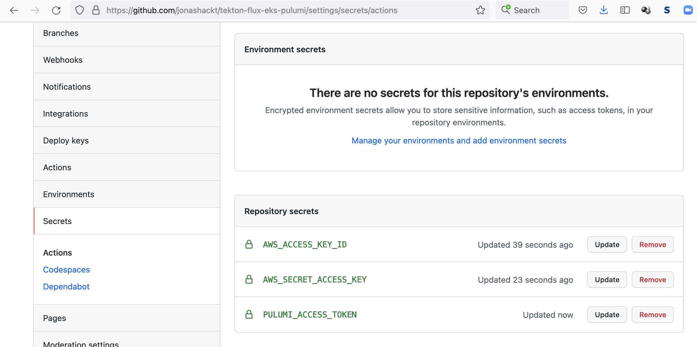

# pulumi-eks-tekton
[](https://github.com/jonashackt/pulumi-eks-tekton/actions)

This Demo repository will deploy and configure a Tekton CI System with Flux on Amazon EKS.


# EKS with Pulumi

Let's simply roll out a AWS EKS cluster with Pulumi:

https://www.pulumi.com/docs/guides/crosswalk/aws/eks/

Our [eks-deployment/index.ts](eks-deployment/index.ts) looks like this:

```typescript
import * as eks from "@pulumi/eks";

// Create an EKS cluster with the default configuration.
const cluster = new eks.Cluster("eks-for-tekton");

// Export the cluster's kubeconfig.
export const kubeconfig = cluster.kubeconfig;
export const eksUrl = cluster.eksCluster.endpoint;
```

To execute our Pulumi program, be sure to be logged into the correct Account at https://app.pulumi.com/your-account-here via `pulumi login` using your Pulumi account's token (do a `pulumi logout` before, if you're already logged into another Pulumi account).

Now select the correct stack and fire up Pulumi with:

```shell
pulumi stack select dev
pulumi up
```

### Accessing the Pulumi created EKS cluster

After your EKS cluster has been setup correctly, use the `kubeconfig` const exported inside our Pulumi program to create the `kubeconfig.yml`:

```shell
pulumi stack output kubeconfig > kubeconfig.yml
```

To access the cluster be sure to have `kubectl` installed. Try accessing it with:

```shell
kubectl --kubeconfig kubeconfig.yml get nodes
```

For merging the new kubeconfig into your systems profile see https://kubernetes.io/docs/concepts/configuration/organize-cluster-access-kubeconfig/

For example you could do:

```shell
pulumi stack output kubeconfig > ~/.kube/config-eks-for-tekton
export KUBECONFIG=~/.kube/config:~/.kube/config-eks-for-tekton
```

Now access via `kubectx` is also possible.


### GitHub Actions using Pulumi to provision AWS EKS

First we need to create GitHub repository secrets containing our AWS API key id & access key (`AWS_ACCESS_KEY_ID` & `AWS_SECRET_ACCESS_KEY`) and our Pulumi access token (`PULUMI_ACCESS_TOKEN`):



Our [provision.yml](.github/workflows/provision.yml) workflow uses Pulumi like we did locally:

```yaml
name: provision

on: [push]

jobs:
  provision-aws-eks:
    runs-on: ubuntu-latest
    env:
      AWS_ACCESS_KEY_ID: ${{ secrets.AWS_ACCESS_KEY_ID }}
      AWS_SECRET_ACCESS_KEY: ${{ secrets.AWS_SECRET_ACCESS_KEY }}
      PULUMI_ACCESS_TOKEN: ${{ secrets.PULUMI_ACCESS_TOKEN }}
      AWS_DEFAULT_REGION: 'eu-central-1'
    # Create an GitHub environment referencing our EKS cluster endpoint
    environment:
      name: tekton-flux-eks-pulumi-dev
      url: ${{ steps.pulumi-up.outputs.eks_url }}
    steps:
      - name: Checkout
        uses: actions/checkout@master

      - name: Setup node env
        uses: actions/setup-node@v2.4.1
        with:
          node-version: '14'

      - name: Cache node_modules
        uses: actions/cache@v2
        with:
          path: ~/.npm
          key: ${{ runner.os }}-node-${{ hashFiles('**/package-lock.json') }}
          restore-keys: |
            ${{ runner.os }}-node-

      - name: Install Pulumi dependencies before npm run generate to prevent it from breaking the build
        run: npm install
        working-directory: ./eks-deployment

      - name: Install Pulumi CLI
        uses: pulumi/action-install-pulumi-cli@v2.0.0

      - name: Provision AWS EKS cluster with Pulumi
        id: pulumi-up
        run: |
          pulumi stack select dev
          pulumi preview
          echo "lets use --suppress-outputs here in order to prevent Pulumi from logging the kubeconfig into public GitHub Action logs"
          pulumi up --yes --suppress-outputs
          pulumi stack output kubeconfig > kubeconfig.yml
          echo "::set-output name=eks_url::$(pulumi stack output eksUrl)/api/hello"
        working-directory: ./eks-deployment

      - name: Try to connect to our EKS cluster using kubectl
        run: kubectl --kubeconfig kubeconfig.yml get nodes
        working-directory: ./eks-deployment


```

Mind to use `--suppress-outputs` flag for our `pulumi up` to prevent the `kubeconfig` from getting logged unmasked. 

We also export our `eks endpoint url` as an GitHub Environment ([as described here](https://stackoverflow.com/a/67385569/4964553)).


#### Prevent the ' getting credentials: exec: executable aws failed with exit code 255' error

I got this error ([see log](https://github.com/jonashackt/tekton-flux-eks-pulumi/runs/4105712645?check_suite_focus=true)): 

```
...
<botocore.awsrequest.AWSRequest object at 0x7f067c580670>
Unable to connect to the server: getting credentials: exec: executable aws failed with exit code 255
Error: Process completed with exit code 1.
```

Luckily this answer brought me into the right direction: https://stackoverflow.com/a/59184490/4964553

I needed to define the `AWS_DEFAULT_REGION: 'eu-central-1'` also solely for `kubectl` in GitHub Actions. With this the error was gone, since the other two variables for `aws-cli` (which is already installed in the GitHub Actions virtual environment) were defined properly. 


# Install Tekton on EKS

https://tekton.dev/docs/getting-started/

Buildpacks: https://buildpacks.io/docs/tools/tekton/


### Tekton Pipelines

https://tekton.dev/docs/getting-started/#installation

So let's add the installation and wait for Tekton to become available:

```yaml
...
      - name: Install Tekton Pipelines
        run: kubectl apply --filename https://storage.googleapis.com/tekton-releases/pipeline/latest/release.yaml

      - name: Wait for Tekton to become ready & show running Tekton pods
        run: |
          kubectl wait --for=condition=ready pod -l app=tekton-pipelines-controller --namespace tekton-pipelines
          kubectl get pods --namespace tekton-pipelines
```

### Persistent Volumes (Optional)

https://tekton.dev/docs/getting-started/#persistent-volumes

Let's check if our EKS cluster [already has a `StorageClass` defined](https://docs.aws.amazon.com/eks/latest/userguide/storage-classes.html) with `kubectl get storageclasses`:

```shell
$ kubectl get storageclasses
NAME            PROVISIONER             RECLAIMPOLICY   VOLUMEBINDINGMODE      ALLOWVOLUMEEXPANSION   AGE
gp2 (default)   kubernetes.io/aws-ebs   Delete          WaitForFirstConsumer   false                  179m
```
Before creating it let's check if there is already a `ConfigMap` defined:

```shell
kubectl describe configmap config-artifact-pvc -n tekton-pipelines
```

From the docs:

> Your Kubernetes cluster, such as one from Google Kubernetes Engine, may have persistent volumes set up at the time of creation, thus no extra step is required

If there's no Persistens Volume defined, we need to create a `ConfigMap` which defines the Persistent Volume Tekton will request:

```shell
kubectl create configmap config-artifact-pvc \
                         --from-literal=size=10Gi \
                         --from-literal=storageClassName=gp2 \
                         -o yaml -n tekton-pipelines \
                         --dry-run=client | kubectl replace -f -
```


### Tekton CLI

Install the Tekton CLI e.g. via homebrew:

```shell
brew tap tektoncd/tools
brew install tektoncd/tools/tektoncd-cli
```

### Run first Tekton Task

See the [task-hello-world.yaml](tekton-ci-config/task-hello-world.yaml):

```yaml
apiVersion: tekton.dev/v1beta1
kind: Task
metadata:
  name: hello
spec:
  steps:
    - name: hello
      image: ubuntu
      command:
        - echo
      args:
        - "Hello World!"
```

Let's apply it to our cluster:

```shell
kubectl apply -f tekton-ci-config/task-hello-world.yaml
```

Let's show our newly created task:

```shell
$ tkn task list
NAMESPACE   NAME    DESCRIPTION   AGE
default     hello                 24 seconds ago
```

Now this is only a Tekton Task definition. We need another Tekton object - the `TaskRun` - in order to run our Task. Create it with:

```shell
tkn task start hello
```

Follow the logs of the TaskRun with:

```shell
tkn taskrun logs --last -f 
```


### Tekton Dashboard

https://tekton.dev/docs/dashboard/

Install it with:

```shell
kubectl apply --filename https://github.com/tektoncd/dashboard/releases/latest/download/tekton-dashboard-release.yaml
```

Now as we already ran some Tasks let's have a look into the Tekton dashboard:

```shell
kubectl proxy --port=8080
```

Then open your Browser at http://localhost:8080/api/v1/namespaces/tekton-pipelines/services/tekton-dashboard:http/proxy/


### Cloud Native Buildpacks

https://buildpacks.io/docs/tools/tekton/

#### Install Tasks

Install [git clone](https://hub.tekton.dev/tekton/task/git-clone) and [buildpacks](https://hub.tekton.dev/tekton/task/buildpacks) Task:
```shell
kubectl apply -f https://raw.githubusercontent.com/tektoncd/catalog/master/task/git-clone/0.4/git-clone.yaml
kubectl apply -f https://raw.githubusercontent.com/tektoncd/catalog/master/task/buildpacks/0.3/buildpacks.yaml
```

#### Create Secret for GitLab Container Registry authorization

To access the GitLab Container Registry we need to first create a PAT or deploy token (see https://docs.gitlab.com/ee/user/packages/container_registry/#authenticate-with-the-container-registry)

Go to `Settings/Repository` inside your GitLab repo - for me this is https://gitlab.com/jonashackt/microservice-api-spring-boot/-/settings/repository

There create a token `TektonBuildpacksToken` under `Deploy tokens` with a username `gitlab-token` and `read_registry` & `write_registry` access. 

Now create GitHub Repository Secrets called `GITLAB_CR_USER` and `GITLAB_CR_PASSWORD` accordingly with the Tokens username and token.

Finally we can create our Secret inside our GitHub Actions pipeline:

https://buildpacks.io/docs/tools/tekton/#42-authorization

```shell
kubectl create secret docker-registry docker-user-pass \
    --docker-server=registry.gitlab.com \
    --docker-username=${{ secrets.GITLAB_CR_USER }} \
    --docker-password=${{ secrets.GITLAB_CR_PASSWORD }} \
    --namespace default
```


Now create a `ServiceAccount` that uses this secret as [ghcr-service-account.yml](tekton-ci-config/ghcr-service-account.yml)

```yaml
apiVersion: v1
kind: ServiceAccount
metadata:
  name: buildpacks-service-account
secrets:
  - name: docker-user-pass
```

#### Create buildpacks PVC 

https://buildpacks.io/docs/tools/tekton/#41-pvcs

Create new [resources.yml](tekton-ci-config/resources.yml):

```yaml
apiVersion: v1
kind: PersistentVolumeClaim
metadata:
  name: buildpacks-source-pvc
spec:
  accessModes:
    - ReadWriteOnce
  resources:
    requests:
      storage: 500Mi
```

#### Create Pipeline

Create [pipeline.yml](tekton-ci-config/pipeline.yml):

```yaml
apiVersion: tekton.dev/v1beta1
kind: Pipeline
metadata:
  name: buildpacks-test-pipeline
spec:
  params:
    - name: image
      type: string
      description: image URL to push
  workspaces:
    - name: source-workspace # Directory where application source is located. (REQUIRED)
    - name: cache-workspace # Directory where cache is stored (OPTIONAL)
  tasks:
    - name: fetch-repository # This task fetches a repository from github, using the `git-clone` task you installed
      taskRef:
        name: git-clone
      workspaces:
        - name: output
          workspace: source-workspace
      params:
        - name: url
          value: https://github.com/buildpacks/samples
        - name: subdirectory
          value: ""
        - name: deleteExisting
          value: "true"
    - name: buildpacks # This task uses the `buildpacks` task to build the application
      taskRef:
        name: buildpacks
      runAfter:
        - fetch-repository
      workspaces:
        - name: source
          workspace: source-workspace
        - name: cache
          workspace: cache-workspace
      params:
        - name: APP_IMAGE
          value: "$(params.image)"
        - name: SOURCE_SUBPATH
          value: "apps/java-maven" # This is the path within the samples repo you want to build (OPTIONAL, default: "")
        - name: BUILDER_IMAGE
          value: paketobuildpacks/builder:base # This is the builder we want the task to use (REQUIRED)
    - name: display-results
      runAfter:
        - buildpacks
      taskSpec:
        steps:
          - name: print
            image: docker.io/library/bash:5.1.4@sha256:b208215a4655538be652b2769d82e576bc4d0a2bb132144c060efc5be8c3f5d6
            script: |
              #!/usr/bin/env bash
              set -e
              echo "Digest of created app image: $(params.DIGEST)"              
        params:
          - name: DIGEST
      params:
        - name: DIGEST
          value: $(tasks.buildpacks.results.APP_IMAGE_DIGEST)
```

And now apply all three configs with:

```shell
kubectl apply -f tekton-ci-config/resources.yml -f tekton-ci-config/ghcr-service-account.yml -f tekton-ci-config/pipeline.yml
```

#### Create PipelineRun

Create [pipeline-run.yml](tekton-ci-config/pipeline-run.yml):

```yaml
apiVersion: tekton.dev/v1beta1
kind: PipelineRun
metadata:
  name: buildpacks-test-pipeline-run
spec:
  serviceAccountName: buildpacks-service-account # Only needed if you set up authorization
  pipelineRef:
    name: buildpacks-test-pipeline
  workspaces:
    - name: source-workspace
      subPath: source
      persistentVolumeClaim:
        claimName: buildpacks-source-pvc
    - name: cache-workspace
      subPath: cache
      persistentVolumeClaim:
        claimName: buildpacks-source-pvc
  params:
    - name: image
      value: ghcr.io/jonashackt/pulumi-eks-tekton-test-image # This defines the name of output image
```

Mind the `params: name: image` and insert an image name containing the correct namespace of your Container Registry you created a Secret for! 

Also apply with

```shell
kubectl apply -f tekton-ci-config/pipeline-run.yml
```


# Integrate Tekton on EKS with GitLab.com

### Tekton Triggers

https://tekton.dev/docs/triggers/install/

Install Tekton Triggers:

```shell
kubectl apply --filename https://storage.googleapis.com/tekton-releases/triggers/latest/release.yaml
kubectl apply --filename https://storage.googleapis.com/tekton-releases/triggers/latest/interceptors.yaml
```


commit-status-tracker...