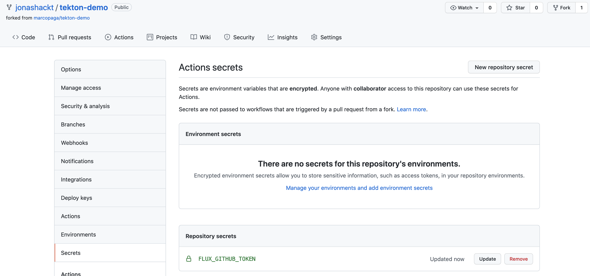

# Tekton CI Demo
[](https://github.com/jonashackt/tekton-flux-eks-pulumi/actions)

This Demo repository will deploy and configure a Tekton CI System with Flux on Amazon EKS.

It is based on my colleague Marco Paga's https://github.com/marcopaga/tekton-demo

## CI of the Tekton CI

This repository uses GitHub Actions to validate the Tekton config. Every commit triggers a cluster creation and validation.
The up-to-date bootstrap process is documented in the GitHub Actions workflow you can find in [this repo](./.github/workflows/create-cluster.yml).

## Cluster Bootstrap

On a high level you need to provide a Github token with the following scopes: `repo_status`, `public_repo`. You can find the management dialog [here](https://github.com/settings/tokens). This token is used by the flux operator to connect to the git repository and roll-out the desired cluster state based on this repository.


## EKS with Pulumi

Let's simply roll out a AWS EKS cluster with Pulumi:

https://www.pulumi.com/docs/guides/crosswalk/aws/eks/

Our [eks-deployment/index.ts](eks-deployment/index.ts) looks like this:

```typescript
import * as eks from "@pulumi/eks";

// Create an EKS cluster with the default configuration.
const cluster = new eks.Cluster("eks-for-tekton");

// Export the cluster's kubeconfig.
export const kubeconfig = cluster.kubeconfig;
export const serveraddress = cluster.eksCluster.endpoint;
```


### GitHub Actions using Pulumi to provision AWS EKS

First we need to create GitHub repository secrets containing our AWS API key id & access key (`AWS_ACCESS_KEY_ID` & `AWS_SECRET_ACCESS_KEY`) and our Pulumi access token (`PULUMI_ACCESS_TOKEN`):


Our [provision.yml](.github/workflows/provision.yml) workflow uses Pulumi like we did locally:

```yaml
name: build-publish-deploy

on: [push]

jobs:
  provision-aws-eks:
    runs-on: ubuntu-latest
    env:
      AWS_ACCESS_KEY_ID: ${{ secrets.AWS_ACCESS_KEY_ID }}
      AWS_SECRET_ACCESS_KEY: ${{ secrets.AWS_SECRET_ACCESS_KEY }}
      PULUMI_ACCESS_TOKEN: ${{ secrets.PULUMI_ACCESS_TOKEN }}
    # Create an GitHub environment referencing our EKS cluster endpoint
    environment:
      name: tekton-flux-eks-pulumi-dev
      url: ${{ steps.pulumi-up.outputs.eks_url }}
    steps:
      - name: Checkout
        uses: actions/checkout@master

      - name: Setup node env
        uses: actions/setup-node@v2.4.1
        with:
          node-version: '14'

      - name: Cache node_modules
        uses: actions/cache@v2
        with:
          path: ~/.npm
          key: ${{ runner.os }}-node-${{ hashFiles('**/package-lock.json') }}
          restore-keys: |
            ${{ runner.os }}-node-

      - name: Install Pulumi dependencies before npm run generate to prevent it from breaking the build
        run: npm install
        working-directory: ./deployment

      - name: Install Pulumi CLI
        uses: pulumi/action-install-pulumi-cli@v2.0.0

      - name: Provision AWS EKS cluster with Pulumi
        id: pulumi-up
        run: |
          pulumi stack select dev
          pulumi preview
          echo "lets use --suppress-outputs here in order to prevent Pulumi from logging the kubeconfig into public GitHub Action logs"
          pulumi up --yes --suppress-outputs
          pulumi stack output kubeconfig > kubeconfig.yml
          echo "::set-output name=eks_url::$(pulumi stack output eksUrl)/api/hello"
        working-directory: ./deployment
        
      - name: Try to connect to our EKS cluster using kubectl
        run: KUBECONFIG=./kubeconfig.yml kubectl get nodes
```

Mind to use `--suppress-outputs` flag for our `pulumi up` to prevent the `kubeconfig` from getting logged unmasked. 

We also export our `eks endpoint url` as an GitHub Environment ([as described here](https://stackoverflow.com/a/67385569/4964553)).


#### 0. Create K3d registry (if you don't already have one):

```sh
k3d registry create registry.localhost --port 5000
```


#### 2. Create K3d cluster that uses the registry, incl. Tekton services and config:

```sh
k3d cluster create --registry-use k3d-registry.localhost:5000
```

This might take some time.

#### 3. Switch kubectl to K3d context & inspect cluster-info

```shell
kubectl config use-context k3d-k3s-default
kubectl cluster-info
```

#### 4. Install Flux components with flux bootstrap:

 ```sh
   GITHUB_TOKEN=<token> flux bootstrap github \
   --owner=<username-of-the-repo-owner> \
   --repository=tekton-demo \
   --private=false \
   --personal=true \
   --branch=main \
   --path=clusters/local
 ```
   
#### 5. Check the progress of the deployment

First wait for the Flux CRD deployment

```shell
kubectl -n default wait --for condition=established --timeout=180s crd/kustomizations.kustomize.toolkit.fluxcd.io
```

Now wait for the Kustomizations to be ready:

```shell
kubectl -n flux-system wait --for=condition=READY=True --timeout=60s kustomizations.kustomize.toolkit.fluxcd.io/flux-system \
kustomizations.kustomize.toolkit.fluxcd.io/tekton-base \
kustomizations.kustomize.toolkit.fluxcd.io/tekton-tasks \
kustomizations.kustomize.toolkit.fluxcd.io/tekton-ci-config
```


#### 6.(optional) Connect to the Tekton Dashboard

The Dashboard is deployed and accessible via the `tekton-dashboard` service on port 9097.

```shell
kubectl --namespace tekton-pipelines port-forward svc/tekton-dashboard 9097:9097
```

## Using the Tekton sample pipeline

You can inspect the deployed tasks and pipelines by issuing those commands. Before following along make sure to install the [CLI tools](https://tekton.dev/docs/getting-started/#set-up-the-cli).

```shell
tkn task list
tkn pipeline list
```

Create a pipeline run as follows and issue it via `kubectl create -f hello-goodbye-pipeline-run.yaml`. This command will return the created pipelinerun which you need for reference later. E.g. enter `tkn pr logs $PIPELINE_RUN_NAME` to get the log output of the pipeline.


# Using the repo yourself

For now in order to run all commands locally you need to fork the repository (otherwise the flux bootstrap doesn't work, since it will not have enough permissions - see https://github.com/marcopaga/tekton-demo/issues/11).

After forking, create a GitHub repository secret called `FLUX_GITHUB_TOKEN` containing your PAT (you need to create one as stated above):



Also remember to actively activate GitHub Actions for your fork.