# aws-eks-tekton-gitlab
[](https://github.com/jonashackt/aws-eks-tekton-gitlab/actions)
[](https://github.com/jonashackt/aws-eks-tekton-gitlab/blob/master/LICENSE)
[](https://renovatebot.com)

This Demo repository shows how to deploy and configure [Tekton](https://tekton.dev/) on Amazon EKS and integrate Tekton with GitLab (especially https://gitlab.com/jonashackt/microservice-api-spring-boot).


# EKS with Pulumi

Let's simply roll out a AWS EKS cluster with Pulumi:

https://www.pulumi.com/docs/guides/crosswalk/aws/eks/

Our [eks-deployment/index.ts](eks-deployment/index.ts) looks like this:

```typescript
import * as eks from "@pulumi/eks";

// Create an EKS cluster with the default configuration.
const cluster = new eks.Cluster("eks-for-tekton");

// Export the cluster's kubeconfig.
export const kubeconfig = cluster.kubeconfig;
export const eksUrl = cluster.eksCluster.endpoint;
```

To execute our Pulumi program, be sure to be logged into the correct Account at https://app.pulumi.com/your-account-here via `pulumi login` using your Pulumi account's token (do a `pulumi logout` before, if you're already logged into another Pulumi account).

Now select the correct stack and fire up Pulumi with:

```shell
pulumi stack select dev
pulumi up
```

### Accessing the Pulumi created EKS cluster

After your EKS cluster has been setup correctly, use the `kubeconfig` const exported inside our Pulumi program to create the `kubeconfig.yml`:

```shell
pulumi stack output kubeconfig > kubeconfig.yml
```

To access the cluster be sure to have `kubectl` installed. Try accessing it with:

```shell
kubectl --kubeconfig kubeconfig.yml get nodes
```

For merging the new kubeconfig into your systems profile see https://kubernetes.io/docs/concepts/configuration/organize-cluster-access-kubeconfig/

For example you could do:

```shell
pulumi stack output kubeconfig > ~/.kube/config-eks-for-tekton
export KUBECONFIG=~/.kube/config:~/.kube/config-eks-for-tekton
```

Now access via `kubectx` is also possible.


### GitHub Actions using Pulumi to provision AWS EKS

First we need to create GitHub repository secrets containing our AWS API key id & access key (`AWS_ACCESS_KEY_ID` & `AWS_SECRET_ACCESS_KEY`) and our Pulumi access token (`PULUMI_ACCESS_TOKEN`):


Our [provision.yml](.github/workflows/provision.yml) workflow uses Pulumi like we did locally:

```yaml
name: provision

on: [push]

jobs:
  provision-aws-eks:
    runs-on: ubuntu-latest
    env:
      AWS_ACCESS_KEY_ID: ${{ secrets.AWS_ACCESS_KEY_ID }}
      AWS_SECRET_ACCESS_KEY: ${{ secrets.AWS_SECRET_ACCESS_KEY }}
      PULUMI_ACCESS_TOKEN: ${{ secrets.PULUMI_ACCESS_TOKEN }}
      AWS_DEFAULT_REGION: 'eu-central-1'
    # Create an GitHub environment referencing our EKS cluster endpoint
    environment:
      name: tekton-flux-eks-pulumi-dev
      url: ${{ steps.pulumi-up.outputs.eks_url }}
    steps:
      - name: Checkout
        uses: actions/checkout@master

      - name: Setup node env
        uses: actions/setup-node@v2.4.1
        with:
          node-version: '14'

      - name: Cache node_modules
        uses: actions/cache@v2
        with:
          path: ~/.npm
          key: ${{ runner.os }}-node-${{ hashFiles('**/package-lock.json') }}
          restore-keys: |
            ${{ runner.os }}-node-

      - name: Install Pulumi dependencies before npm run generate to prevent it from breaking the build
        run: npm install
        working-directory: ./eks-deployment

      - name: Install Pulumi CLI
        uses: pulumi/action-install-pulumi-cli@v2.0.0

      - name: Provision AWS EKS cluster with Pulumi
        id: pulumi-up
        run: |
          pulumi stack select dev
          pulumi preview
          echo "lets use --suppress-outputs here in order to prevent Pulumi from logging the kubeconfig into public GitHub Action logs"
          pulumi up --yes --suppress-outputs
          pulumi stack output kubeconfig > kubeconfig.yml
          echo "::set-output name=eks_url::$(pulumi stack output eksUrl)/api/hello"
        working-directory: ./eks-deployment

      - name: Try to connect to our EKS cluster using kubectl
        run: kubectl --kubeconfig kubeconfig.yml get nodes
        working-directory: ./eks-deployment


```

Mind to use `--suppress-outputs` flag for our `pulumi up` to prevent the `kubeconfig` from getting logged unmasked. 

We also export our `eks endpoint url` as an GitHub Environment ([as described here](https://stackoverflow.com/a/67385569/4964553)).


#### Prevent the ' getting credentials: exec: executable aws failed with exit code 255' error

I got this error ([see log](https://github.com/jonashackt/tekton-flux-eks-pulumi/runs/4105712645?check_suite_focus=true)): 

```
...
<botocore.awsrequest.AWSRequest object at 0x7f067c580670>
Unable to connect to the server: getting credentials: exec: executable aws failed with exit code 255
Error: Process completed with exit code 1.
```

Luckily this answer brought me into the right direction: https://stackoverflow.com/a/59184490/4964553

I needed to define the `AWS_DEFAULT_REGION: 'eu-central-1'` also solely for `kubectl` in GitHub Actions. With this the error was gone, since the other two variables for `aws-cli` (which is already installed in the GitHub Actions virtual environment) were defined properly. 


# Install Tekton on EKS

https://tekton.dev/docs/getting-started/

Buildpacks: https://buildpacks.io/docs/tools/tekton/


### Tekton Pipelines

https://tekton.dev/docs/getting-started/#installation

So let's add the installation and wait for Tekton to become available:

```yaml
...
      - name: Install Tekton Pipelines
        run: kubectl apply --filename https://storage.googleapis.com/tekton-releases/pipeline/latest/release.yaml

      - name: Wait for Tekton to become ready & show running Tekton pods
        run: |
          kubectl wait --for=condition=ready pod -l app=tekton-pipelines-controller --namespace tekton-pipelines
          kubectl get pods --namespace tekton-pipelines
```

### Persistent Volumes (Optional)

https://tekton.dev/docs/getting-started/#persistent-volumes

Let's check if our EKS cluster [already has a `StorageClass` defined](https://docs.aws.amazon.com/eks/latest/userguide/storage-classes.html) with `kubectl get storageclasses`:

```shell
$ kubectl get storageclasses
NAME            PROVISIONER             RECLAIMPOLICY   VOLUMEBINDINGMODE      ALLOWVOLUMEEXPANSION   AGE
gp2 (default)   kubernetes.io/aws-ebs   Delete          WaitForFirstConsumer   false                  179m
```
Before creating it let's check if there is already a `ConfigMap` defined:

```shell
kubectl describe configmap config-artifact-pvc -n tekton-pipelines
```

From the docs:

> Your Kubernetes cluster, such as one from Google Kubernetes Engine, may have persistent volumes set up at the time of creation, thus no extra step is required

If there's no Persistens Volume defined, we need to create a `ConfigMap` which defines the Persistent Volume Tekton will request:

```shell
kubectl create configmap config-artifact-pvc \
                         --from-literal=size=10Gi \
                         --from-literal=storageClassName=gp2 \
                         -o yaml -n tekton-pipelines \
                         --dry-run=client | kubectl replace -f -
```


### Tekton CLI

Install the Tekton CLI e.g. via homebrew:

```shell
brew tap tektoncd/tools
brew install tektoncd/tools/tektoncd-cli
```

### Run first Tekton Task

See the [task-hello-world.yaml](tekton-ci-config/task-hello-world.yaml):

```yaml
apiVersion: tekton.dev/v1beta1
kind: Task
metadata:
  name: hello
spec:
  steps:
    - name: hello
      image: ubuntu
      command:
        - echo
      args:
        - "Hello World!"
```

Let's apply it to our cluster:

```shell
kubectl apply -f tekton-ci-config/task-hello-world.yaml
```

Let's show our newly created task:

```shell
$ tkn task list
NAMESPACE   NAME    DESCRIPTION   AGE
default     hello                 24 seconds ago
```

Now this is only a Tekton Task definition. We need another Tekton object - the `TaskRun` - in order to run our Task. Create it with:

```shell
tkn task start hello
```

Follow the logs of the TaskRun with:

```shell
tkn taskrun logs --last -f 
```


# Tekton Dashboard

https://tekton.dev/docs/dashboard/

Install it with:

```shell
kubectl apply --filename https://github.com/tektoncd/dashboard/releases/latest/download/tekton-dashboard-release.yaml
```

Now as we already ran some Tasks let's have a look into the Tekton dashboard:

```shell
kubectl proxy --port=8080
```

Then open your Browser at http://localhost:8080/api/v1/namespaces/tekton-pipelines/services/tekton-dashboard:http/proxy/


### Expose Tekton Dashboard publicly on EKS

The ultra simple (but only PoC grade) solution to expose an public endpoint on a Cloud Provider's managed K8s is to use a `Service` with type `LoadBalancer`. As the docs state (https://kubernetes.io/docs/concepts/services-networking/service/#loadbalancer):

> On cloud providers which support external load balancers, setting the type field to LoadBalancer provisions a load balancer for your Service. The actual creation of the load balancer happens asynchronously, and information about the provisioned balancer is published in the Service's .status.loadBalancer field.

And also the AWS EKS docs state this (https://docs.aws.amazon.com/eks/latest/userguide/network-load-balancing.html):

> When you create a Kubernetes Service of type LoadBalancer, an AWS Network Load Balancer (NLB) is provisioned that load balances network traffic.


### Service yaml

So this would be our ultra simple Service to access our Tekton Dashboard (see [tekton-dashboard-service.yml](tekton-dashboard-service.yml)):

```yaml
apiVersion: v1
kind: Service
metadata:
  name: tekton-dashboard-external-svc-manual
spec:
  selector:
    app: tekton-dashboard
  ports:
    - protocol: TCP
      port: 80
      targetPort: 9097
  type: LoadBalancer
```

But it's not that easy to simply apply it and grab the url. Have a look inside our [provision.yml](.github/workflows/provision.yml) for all commands in working order. Here are the steps:

First we `apply` our [tekton-dashboard-service.yml](tekton-dashboard-service.yml):

```yaml
kubectl apply -f tekton-dashboard-service.yml -n tekton-pipelines
```

### Wait until AWS ELB is provisioned & populated into `status.loadBalancer.ingress[0].hostname`

Then we have to wait until our AWS ELB LoadBalancer is provisioned. [As stated](https://kubernetes.io/docs/concepts/services-networking/service/#loadbalancer) the

> ...actual creation of the load balancer happens asynchronously, and information about the provisioned balancer is published in the Service's .status.loadBalancer field.

If the LoadBalancer is readily provisioned, a `kubectl get service/tekton-dashboard-external-svc-manual --output=yaml` shows us the following:

```yaml
apiVersion: v1
kind: Service
metadata:
  annotations:
    kubectl.kubernetes.io/last-applied-configuration: |
      {"apiVersion":"v1","kind":"Service","metadata":{"annotations":{},"name":"tekton-dashboard-external-svc-manual","namespace":"tekton-pipelines"},"spec":{"ports":[{"port":80,"protocol":"TCP","targetPort":9097}],"selector":{"app":"tekton-dashboard"},"type":"LoadBalancer"}}
  creationTimestamp: "2021-11-23T09:07:27Z"
  finalizers:
  - service.kubernetes.io/load-balancer-cleanup
  name: tekton-dashboard-external-svc-manual
  namespace: tekton-pipelines
  resourceVersion: "677614"
  uid: 26431f31-0b27-4df3-a6cd-3d32f825cd5f
spec:
  clusterIP: 10.100.42.167
  clusterIPs:
  - 10.100.42.167
  externalTrafficPolicy: Cluster
  ipFamilies:
  - IPv4
  ipFamilyPolicy: SingleStack
  ports:
  - nodePort: 31306
    port: 80
    protocol: TCP
    targetPort: 9097
  selector:
    app: tekton-dashboard
  sessionAffinity: None
  type: LoadBalancer
status:
  loadBalancer:
    ingress:
    - hostname: a26431f310b274df3a6cd3d32f825cd5-1729774979.eu-central-1.elb.amazonaws.com
```

So we have to somehow wait for the field `status.loadBalancer` to contain the `ingress[0].hostname` (remember to use the list selector `[0]` here, since `hostname` is represented as list).

But since the field `ingress[0].hostname` isn't present at first, a direct access via `kubectl get service tekton-dashboard-external-svc-manual -n tekton-pipelines --output=jsonpath='{.status.loadBalancer.ingress[0].hostname}'` would result in zero results.

As `kubectl wait` [isn't capable of beeing used without `status.conditions` ](https://github.com/kubernetes/kubernetes/issues/80828#issuecomment-517555879) fields present right now (see the issue [kubectl wait on arbitrary jsonpath](https://github.com/kubernetes/kubernetes/issues/83094), the solution is beeing merged into `v1.23` (see this PR https://github.com/kubernetes/kubernetes/pull/105776)), we need to find an alternative way for now.

For a solution see this so answer https://stackoverflow.com/questions/70108499/kubectl-wait-for-service-on-aws-eks-to-expose-elastic-load-balancer-elb-addres

Therefore the answer ["watch" the output of a command until a particular string is observed and then exit](https://superuser.com/a/375331/497608) comes in handy:

```shell
until my_cmd | grep "String Im Looking For"; do : ; done
```

If we use this approach together with a `kubectl get` we can craft a command which will wait until the field `ingress` gets populated into the `status.loadBalancer` field in our Service:

```shell
until kubectl get service/tekton-dashboard-external-svc-manual -n tekton-pipelines --output=jsonpath='{.status.loadBalancer}' | grep "ingress"; do : ; done
```


### Grab the Tekton Dashboard URL and populate as GitHub Environment

Now that our AWS ELB is provisioned we can finally grad it's URL with:

```shell
kubectl get service tekton-dashboard-external-svc-manual -n tekton-pipelines --output=jsonpath='{.status.loadBalancer.ingress[0].hostname}'
```

Then it's easy to use the output and create a GitHub step variable, which is used in the GitHub Environment definition at the top of the job:

```yaml
echo "--- Create GitHub environment var"
DASHBOARD_HOST=$(kubectl get service tekton-dashboard-external-svc-manual -n tekton-pipelines --output=jsonpath='{.status.loadBalancer.ingress[0].hostname}')
echo "The Tekton dashboard is accessible at $DASHBOARD_HOST - creating GitHub Environment"
echo "::set-output name=dashboard_host::http://$DASHBOARD_HOST"
```


# Cloud Native Buildpacks

https://buildpacks.io/docs/tools/tekton/

### Install Tasks

Install [git clone](https://hub.tekton.dev/tekton/task/git-clone) and [buildpacks](https://hub.tekton.dev/tekton/task/buildpacks) Task:
```shell
kubectl apply -f https://raw.githubusercontent.com/tektoncd/catalog/master/task/git-clone/0.4/git-clone.yaml
kubectl apply -f https://raw.githubusercontent.com/tektoncd/catalog/master/task/buildpacks/0.3/buildpacks.yaml
```

### Create Secret for GitLab Container Registry authorization

To access the GitLab Container Registry we need to first create a PAT or deploy token (see https://docs.gitlab.com/ee/user/packages/container_registry/#authenticate-with-the-container-registry)

Go to `Settings/Repository` inside your GitLab repo - for me this is https://gitlab.com/jonashackt/microservice-api-spring-boot/-/settings/repository

There create a token `TektonBuildpacksToken` under `Deploy tokens` with a username `gitlab-token` and `read_registry` & `write_registry` access. 

Now create GitHub Repository Secrets called `GITLAB_CR_USER` and `GITLAB_CR_PASSWORD` accordingly with the Tokens username and token.

Finally we can create our Secret inside our GitHub Actions pipeline:

https://buildpacks.io/docs/tools/tekton/#42-authorization

```shell
kubectl create secret docker-registry docker-user-pass \
    --docker-server=registry.gitlab.com \
    --docker-username=${{ secrets.GITLAB_CR_USER }} \
    --docker-password=${{ secrets.GITLAB_CR_PASSWORD }} \
    --namespace default
```

After the first successful secret creation, we sadly get the error `error: failed to create secret secrets "docker-user-pass" already exists` - which is correct, since the secret already exists.

But there's help (see https://stackoverflow.com/a/45881259/4964553): We add `--save-config --dry-run=client -o yaml | kubectl apply -f -` to our command like this:

```shell
kubectl create secret docker-registry docker-user-pass \
    --docker-server=registry.gitlab.com \
    --docker-username=${{ secrets.GITLAB_CR_USER }} \
    --docker-password=${{ secrets.GITLAB_CR_PASSWORD }} \
    --namespace default \
    --save-config --dry-run=client -o yaml | kubectl apply -f -
```

Now we made an `apply` out of our `create` kubectl command, which we can use repetitively :)


We also need to create a `ServiceAccount` that uses this secret as [ghcr-service-account.yml](tekton-ci-config/ghcr-service-account.yml)

```yaml
apiVersion: v1
kind: ServiceAccount
metadata:
  name: buildpacks-service-account
secrets:
  - name: docker-user-pass
```

### Create buildpacks PVC 

https://buildpacks.io/docs/tools/tekton/#41-pvcs

Create new [resources.yml](tekton-ci-config/resources.yml):

```yaml
apiVersion: v1
kind: PersistentVolumeClaim
metadata:
  name: buildpacks-source-pvc
spec:
  accessModes:
    - ReadWriteOnce
  resources:
    requests:
      storage: 500Mi
```

### Create Pipeline

Create [pipeline.yml](tekton-ci-config/pipeline.yml):

```yaml
apiVersion: tekton.dev/v1beta1
kind: Pipeline
metadata:
  name: buildpacks-test-pipeline
spec:
  params:
    - name: image
      type: string
      description: image URL to push
  workspaces:
    - name: source-workspace # Directory where application source is located. (REQUIRED)
    - name: cache-workspace # Directory where cache is stored (OPTIONAL)
  tasks:
    - name: fetch-repository # This task fetches a repository from github, using the `git-clone` task you installed
      taskRef:
        name: git-clone
      workspaces:
        - name: output
          workspace: source-workspace
      params:
        - name: url
          value: https://github.com/buildpacks/samples
        - name: subdirectory
          value: ""
        - name: deleteExisting
          value: "true"
    - name: buildpacks # This task uses the `buildpacks` task to build the application
      taskRef:
        name: buildpacks
      runAfter:
        - fetch-repository
      workspaces:
        - name: source
          workspace: source-workspace
        - name: cache
          workspace: cache-workspace
      params:
        - name: APP_IMAGE
          value: "$(params.image)"
        - name: SOURCE_SUBPATH
          value: "apps/java-maven" # This is the path within the samples repo you want to build (OPTIONAL, default: "")
        - name: BUILDER_IMAGE
          value: paketobuildpacks/builder:base # This is the builder we want the task to use (REQUIRED)
    - name: display-results
      runAfter:
        - buildpacks
      taskSpec:
        steps:
          - name: print
            image: docker.io/library/bash:5.1.4@sha256:b208215a4655538be652b2769d82e576bc4d0a2bb132144c060efc5be8c3f5d6
            script: |
              #!/usr/bin/env bash
              set -e
              echo "Digest of created app image: $(params.DIGEST)"              
        params:
          - name: DIGEST
      params:
        - name: DIGEST
          value: $(tasks.buildpacks.results.APP_IMAGE_DIGEST)
```

And now apply all three configs with:

```shell
kubectl apply -f tekton-ci-config/resources.yml -f tekton-ci-config/ghcr-service-account.yml -f tekton-ci-config/pipeline.yml
```

### Create PipelineRun

Create [pipeline-run.yml](tekton-ci-config/pipeline-run.yml):

```yaml
apiVersion: tekton.dev/v1beta1
kind: PipelineRun
metadata:
  generateName: buildpacks-test-pipeline-run-
spec:
  serviceAccountName: buildpacks-service-account-gitlab # Only needed if you set up authorization
  pipelineRef:
    name: buildpacks-test-pipeline
  workspaces:
    - name: source-workspace
      subPath: source
      persistentVolumeClaim:
        claimName: buildpacks-source-pvc
    - name: cache-workspace
      subPath: cache
      persistentVolumeClaim:
        claimName: buildpacks-source-pvc
  params:
    - name: image
      value: registry.gitlab.com/jonashackt/microservice-api-spring-boot # This defines the name of output image
```

A crucial point here is to change the `metadata: name: buildpacks-test-pipeline-run` into `metadata: generateName: buildpacks-test-pipeline-run-`. Why? Because if we use the `name` parameter every `kubectl apply` tries to create the `PipelineRun` object with the same name which results in errors like this:

```shell
Error from server (AlreadyExists): error when creating "tekton-ci-config/pipeline-run.yml": pipelineruns.tekton.dev "buildpacks-test-pipeline-run" already exists
```

Using the `generateName` field fixes our problem (see https://stackoverflow.com/questions/69880096/how-to-restart-tekton-pipelinerun-having-a-pipeline-run-yml-defined-in-git-e-g/69880097#69880097), although we should implement a kind of garbage collection for our PipelineRun objects...


Also mind the `params: name: image` and insert an image name containing the correct namespace of your Container Registry you created a Secret for! 

Also apply with

```shell
kubectl apply -f tekton-ci-config/pipeline-run.yml
```

Looking into the Tekton dashboard we should now finally see a successful Pipeline run:


### Cache Buildpacks builds with cache image

It's extremey easy to leverage the Buildpacks cache image feature, that will create a separate cache image for building and will store it alongside the resulting app image in our Container Registry.

Therefore simply add the `CACHE_IMAGE` parameter using our `$(params.IMAGE)` definition and appending `:paketo-build-cache` like this inside our Pipeline:

```yaml
      params:
        - name: APP_IMAGE
          value: "$(params.IMAGE)"
        - name: CACHE_IMAGE
          value: "$(params.IMAGE):paketo-build-cache"
        - name: BUILDER_IMAGE
          value: paketobuildpacks/builder:base # This is the builder we want the task to use (REQUIRED)
```

Now the next build should produce a separate image inside our Container Registry:

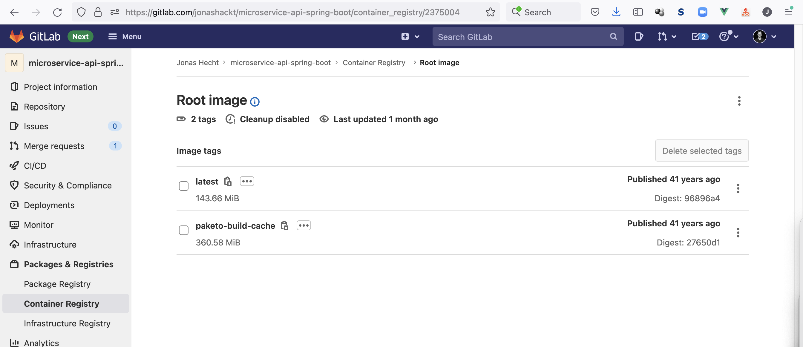


### Add Maven Task to Pipeline

What about extending our Tekton Pipeline with a Maven Task, that initiates a test run before we build our app container using Buildpacks.

Therefore we can simply use the https://hub.tekton.dev/tekton/task/maven Task from Tekton Hub.

First we need to install the Task in our GitHub Actions [provision.yml](.github/workflows/provision.yml):

```yaml
kubectl apply -f https://raw.githubusercontent.com/tektoncd/catalog/main/task/maven/0.2/maven.yaml
```

Now we need to enhance our [pipeline.yml](tekton-ci-config/pipeline.yml) with a new workspace `maven-settings` and the Task definition `maven-test`, which should also be defined as `runAfter` target in the `buildpacks` Task:  

```yaml
  workspaces:
    - name: maven-settings # Maven settings, see https://hub.tekton.dev/tekton/task/maven
      ...
  tasks:
    ...
    - name: maven-test
      taskRef:
        name: maven
      runAfter:
        - fetch-repository
      params:
        - name: GOALS
          value:
            - verify
      workspaces:
        - name: maven-settings
          workspace: maven-settings
        - name: source
          workspace: source-workspace
    - name: buildpacks # This task uses the `buildpacks` task to build the application
      taskRef:
        name: buildpacks
      runAfter:
        - maven-test
```

We also should enhance our [pipeline-run.yml](tekton-ci-config/pipeline-run.yml) and [gitlab-push-listener.yml](tekton-ci-config/triggers/gitlab-push-listener.yml) to define the additional workspace:

```yaml
  pipelineRef:
    name: buildpacks-test-pipeline
  workspaces:
    - name: maven-settings
      emptyDir: {}
```

Finally we should also add the new workspace with `--workspace name=maven-settings,emptyDir=` to our `tkn pipeline start` command in the project's branch https://gitlab.com/jonashackt/microservice-api-spring-boot/-/tree/trigger-tekton-via-gitlabci inside the `.gitlab-ci.yml`:

```shell
tkn pipeline start buildpacks-test-pipeline \
  --serviceaccount buildpacks-service-account-gitlab \
  --workspace name=maven-settings,emptyDir= \
  --workspace name=source-workspace,subPath=source,claimName=buildpacks-source-pvc \
  --workspace name=cache-workspace,subPath=cache,claimName=buildpacks-source-pvc \
  --param IMAGE=registry.gitlab.com/jonashackt/microservice-api-spring-boot \
  --param SOURCE_URL=https://gitlab.com/jonashackt/microservice-api-spring-boot \
  --param REPO_PATH_ONLY=jonashackt/microservice-api-spring-boot \
  --param SOURCE_REVISION=main \
  --param GITLAB_HOST=gitlab.com \
  --param TEKTON_DASHBOARD_HOST="http://abd1c6f235c9642bf9d4cdf632962298-1232135946.eu-central-1.elb.amazonaws.com" \
  --timeout 240s \
  --showlog
```


### Add caching to Maven Task

It seems that the [Tekton Hub's Maven Task](https://hub.tekton.dev/tekton/task/maven) doesn't implement caching for us. Our builds tend to download all Maven dependencies over and over again:

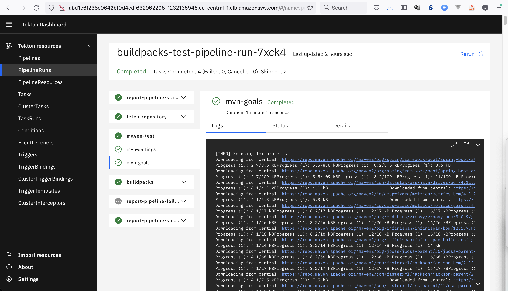

As stated in https://developers.redhat.com/blog/2020/02/26/speed-up-maven-builds-in-tekton-pipelines#maven_task_with_a_workspace we need to define our own Task for that.

As we don't need the `settings.xml` configuration (e.g. for Proxy settings), which is the main point of the Tekton Hub's Maven Task, we can simply create our own - see [task-maven-with-cache.yml](tekton-ci-config/task-maven-with-cache.yml):

```yaml
apiVersion: tekton.dev/v1alpha1
kind: Task
metadata:
  name: maven-with-cache
spec:
  workspaces:
    - name: source
      description: The workspace consisting of maven project.
    - name: maven-repo-cache
      description: The workspace holding the Maven repository for caching.
  params:
    - name: GOALS
      description: The Maven goals to run
      type: array
      default:
        - "package"
  steps:
    - name: mvn
      image: gcr.io/cloud-builders/mvn
      workingDir: $(workspaces.source.path)
      command: ["/usr/bin/mvn"]
      args:
        - -Dmaven.repo.local=$(workspaces.maven-repo-cache.path)
        - "$(params.GOALS)"
```

We need to `kubectl apply` our Task `maven-with-cache` with:

```shell
kubectl apply -f tekton-ci-config/task-maven-with-cache.yml
```


We also need to use our new Maven Task inside our [pipeline.yml](tekton-ci-config/pipeline.yml):

```yaml
workspaces:
  - name: maven-repo-cache # Maven repository cahce, see https://developers.redhat.com/blog/2020/02/26/speed-up-maven-builds-in-tekton-pipelines#run_a_maven_pipeline

...

    - name: maven-test
      taskRef:
        name: maven-with-cache
      runAfter:
        - fetch-repository
      params:
        - name: GOALS
          value:
            - verify
      workspaces:
        - name: source
          workspace: source-workspace
        - name: maven-repo-cache
          workspace: maven-repo-cache
```

Now we could try to also create a new `PersistentVolumeClaim` as stated in https://developers.redhat.com/blog/2020/02/26/speed-up-maven-builds-in-tekton-pipelines#run_a_maven_pipeline

```yaml
    - name: maven-repo-cache
      persistentVolumeClaim:
        claimName: maven-repo-cache-pvc
```

But we would run into errors like:

```shell
completionTime: '2021-12-06T09:13:49Z'
conditions:  - lastTransitionTime: '2021-12-06T09:13:49Z'
    message: more than one PersistentVolumeClaim is bound
    reason: TaskRunValidationFailed
    status: 'False'
    type: 
```

It seems that Tekton doesn't like to have multiple PVC inside one Task: https://github.com/tektoncd/pipeline/issues/3480 and https://github.com/tektoncd/pipeline/issues/3085

> In general, try to only use a single PVC for each task.

So we need to use a separate `subPath` inside our already existing PVC `buildpacks-source-pvc` (which doesn't have a matching name any more it seems :) ).

As stated in https://buildpacks.io/docs/tools/tekton/#43-pipeline __a Tekton workspace could be simply seen as a shared directory__ (see https://tekton.dev/docs/pipelines/workspaces/, where I didn't get this first).

So we finally simply provide a new workspace using the existing PVC but a different `subPath` to our [pipeline-run.yml](tekton-ci-config/pipeline-run.yml) & [gitlab-push-listener.yml](tekton-ci-config/triggers/gitlab-push-listener.yml):

```yaml
    - name: maven-repo-cache
      subPath: maven-repo-cache
      persistentVolumeClaim:
        claimName: buildpacks-source-pvc
```


And we can even optimize our solution by simply using the `maven-settings` workspace definition of the [standard Tekton Hub's Maven Task](https://hub.tekton.dev/tekton/task/maven) inside our Pipeline

```yaml
workspaces:
  - name: maven-repo-cache # Maven repository cahce, see https://developers.redhat.com/blog/2020/02/26/speed-up-maven-builds-in-tekton-pipelines#run_a_maven_pipeline

...
    - name: maven-test
      taskRef:
        name: maven
      runAfter:
        - fetch-repository
      params:
        - name: GOALS
          value:
            - -Dmaven.repo.local=$(workspaces.maven-settings.path)
            - verify
      workspaces:
        - name: source
          workspace: source-workspace
        - name: maven-settings
          workspace: maven-repo-cache
```

Now our Pipeline should run faster then before, since the Maven cache is used:

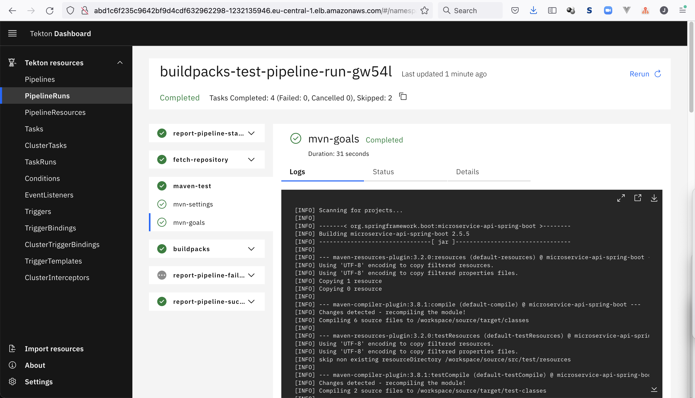


# Integrate Tekton on EKS with GitLab.com

How to trigger Tekton `PipelineRun` from GitLab?


## Trigger Tekton directly from GitLab CI

The simplest possible solution is to leverage GitLab CI and trigger Tekton from there.

See https://stackoverflow.com/a/69991508/4964553

Have a look at this example gitlab.com project https://gitlab.com/jonashackt/microservice-api-spring-boot/-/tree/trigger-tekton-via-gitlabci


## Tekton Triggers

Full getting-started guide: https://github.com/tektoncd/triggers/tree/v0.17.0/docs/getting-started

__BUT FIRST__ Examples are a great inspiration - for GitLab this is especially:

https://github.com/tektoncd/triggers/tree/main/examples/v1beta1/gitlab


### Install Tekton Triggers

https://tekton.dev/docs/triggers/install/

```shell
kubectl apply --filename https://storage.googleapis.com/tekton-releases/triggers/latest/release.yaml
kubectl apply --filename https://storage.googleapis.com/tekton-releases/triggers/latest/interceptors.yaml
```


### ServiceAccount, RoleBinding & ClusterRoleBinding

See https://github.com/tektoncd/triggers/blob/v0.17.0/examples/rbac.yaml

So we also create [serviceaccount-rb-crb.yml](tekton-ci-config/triggers/serviceaccount-rb-crb.yml):

```yaml
apiVersion: v1
kind: ServiceAccount
metadata:
  name: tekton-triggers-example-sa
---
apiVersion: rbac.authorization.k8s.io/v1
kind: RoleBinding
metadata:
  name: triggers-example-eventlistener-binding
subjects:
- kind: ServiceAccount
  name: tekton-triggers-example-sa
roleRef:
  apiGroup: rbac.authorization.k8s.io
  kind: ClusterRole
  name: tekton-triggers-eventlistener-roles
---
apiVersion: rbac.authorization.k8s.io/v1
kind: ClusterRoleBinding
metadata:
  name: triggers-example-eventlistener-clusterbinding
subjects:
- kind: ServiceAccount
  name: tekton-triggers-example-sa
  namespace: default
roleRef:
  apiGroup: rbac.authorization.k8s.io
  kind: ClusterRole
  name: tekton-triggers-eventlistener-clusterroles
```

```shell
kubectl apply -f tekton-ci-config/triggers/serviceaccount-rb-crb.yml
```


### Tekton Trigger Secret

As our Tekton Trigger API will be setup as a public API in the end, we need to secure our Trigger API somehow.

One way is to create a secret ID the calling JSON must contain. So let's create [tekton-trigger-secret.yml](tekton-ci-config/triggers/tekton-trigger-secret.yml):

```yaml
apiVersion: v1
kind: Secret
metadata:
  name: gitlab-secret
type: Opaque
stringData:
  secretToken: "1234567"
```

```shell
kubectl apply -f tekton-ci-config/triggers/tekton-trigger-secret.yml
```

### EventListener

So let's start with the `EventListener` . We'll adapt the `EventListener` from the example (see https://github.com/tektoncd/triggers/blob/main/examples/v1beta1/gitlab/gitlab-push-listener.yaml) to use our Buildpacks Pipeline defined in [pipeline.yml](tekton-ci-config/pipeline.yml).

Therefore let's create a new file called [gitlab-push-listener.yml](tekton-ci-config/triggers/gitlab-push-listener.yml):

```yaml
apiVersion: triggers.tekton.dev/v1beta1
kind: EventListener
metadata:
  name: gitlab-listener
spec:
  serviceAccountName: tekton-triggers-example-sa
  triggers:
    - name: gitlab-push-events-trigger
      interceptors:
        - name: "verify-gitlab-payload"
          ref:
            name: "gitlab"
            kind: ClusterInterceptor
          params:
            - name: secretRef
              value:
                secretName: "gitlab-secret"
                secretKey: "secretToken"
            - name: eventTypes
              value:
                - "Push Hook"
      bindings:
        - name: gitrevision
          value: $(body.checkout_sha)
        - name: gitrepositoryurl
          value: $(body.repository.git_http_url)
      template:
        spec:
          params:
            - name: gitrevision
            - name: gitrepositoryurl
            - name: message
              description: The message to print
              default: This is the default message
            - name: contenttype
              description: The Content-Type of the event
          resourcetemplates:
            - apiVersion: tekton.dev/v1beta1
              kind: PipelineRun
              metadata:
                generateName: buildpacks-test-pipeline-run-
                #name: buildpacks-test-pipeline-run
              spec:
                serviceAccountName: buildpacks-service-account-gitlab # Only needed if you set up authorization
                pipelineRef:
                  name: buildpacks-test-pipeline
                workspaces:
                  - name: source-workspace
                    subPath: source
                    persistentVolumeClaim:
                      claimName: buildpacks-source-pvc
                  - name: cache-workspace
                    subPath: cache
                    persistentVolumeClaim:
                      claimName: buildpacks-source-pvc
                params:
                  - name: IMAGE
                    value: registry.gitlab.com/jonashackt/microservice-api-spring-boot # This defines the name of output image
                  - name: SOURCE_URL
                    value: https://gitlab.com/jonashackt/microservice-api-spring-boot
                  - name: SOURCE_REVISION
                    value: main

```

Now apply it to our cluster via:

```shell
kubectl apply -f tekton-ci-config/triggers/gitlab-push-listener.yml
```

> Tekton Triggers creates a new Deployment and Service for the EventListener

As stated in https://tekton.dev/docs/triggers/eventlisteners/#understanding-the-deployment-of-an-eventlistener 

> Tekton Triggers uses the EventListener name prefixed with el- to name the Deployment and Service when instantiating them.

this will also deploy a K8s `Service` called `el-gitlab-listener` and a `Deployment` also called `el-gitlab-listener`:

```shell
$ k get deployment
NAME                 READY   UP-TO-DATE   AVAILABLE   AGE
el-gitlab-listener   1/1     1            1           25h

$ k get service
NAME                 TYPE        CLUSTER-IP       EXTERNAL-IP   PORT(S)             AGE
el-gitlab-listener   ClusterIP   10.100.101.207   <none>        8080/TCP,9000/TCP   12m
...
```


### Create GitLab Webhook & Craft a Push test event .json

What we need here is an example test event as `.json` file. For an example see https://github.com/tektoncd/triggers/blob/main/examples/v1beta1/gitlab/gitlab-push-event.json

But we can craft this file ourselves while creating the GitLab Webhook.

Therefore go to your project (in my example here this is https://gitlab.com/jonashackt/microservice-api-spring-boot) and head over to __Settings/Webhooks__.

Now insert our a fake URL like `http://www.google.com` into the __URL__ field (we need a semantically correct url here in order to be able to save the Webhook, but will change it later to the EventListeners Ingress URL).

Also insert our Secret Token `1234567` in the __Secret Token__ field.

Finally choose __Push events__, deselect SSL verification and scroll down and hit __Add webhook__. 

This should result in the Webhook beeing created and listed right at the bottom of this page (scroll down again) in a list called `Project Hooks`.

Click on __Test__ and choose __Push events__. This will fire a test event (which will produce a HTTP error). Now scroll down again an click on __edit__. Scroll down inside our WebHook (don't get confused with the UI :)) and you should see the __Recent events__ list:

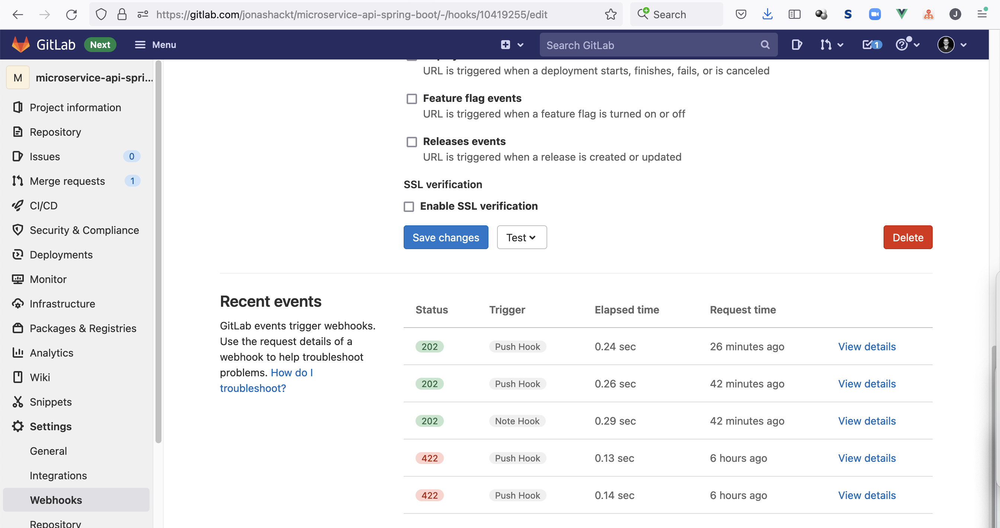

Choose the latest event and click on `View details`. Scroll down again and you should see the __Request__ frame with the generated request json:

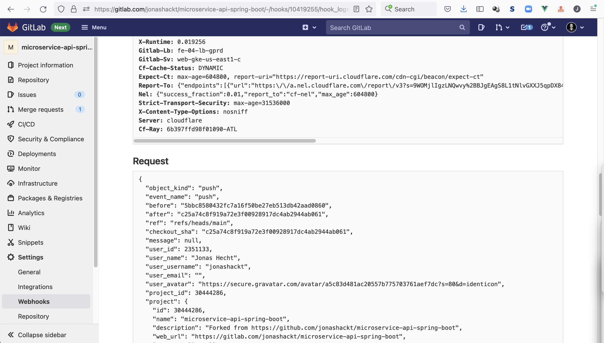

Copy the whole part into a local file. In this example project this file is called [gitlab-push-test-event.json](tekton-ci-config/triggers/gitlab-push-test-event.json):

```json
{
  "object_kind": "push",
  "event_name": "push",
  "before": "5bbc8580432fc7a16f50be27eb513db42aad0860",
  "after": "c25a74c8f919a72e3f00928917dc4ab2944ab061",
  "ref": "refs/heads/main",
  "checkout_sha": "c25a74c8f919a72e3f00928917dc4ab2944ab061",
  "message": null,
  "user_id": 2351133,
  "user_name": "Jonas Hecht",
  "user_username": "jonashackt",
  "user_email": "",
  "user_avatar": "https://secure.gravatar.com/avatar/a5c83d481ac20557b775703761aef7dc?s=80&d=identicon",
  "project_id": 30444286,
  "project": {
    "id": 30444286,
    "name": "microservice-api-spring-boot",
    "description": "Forked from https://github.com/jonashackt/microservice-api-spring-boot",
    "web_url": "https://gitlab.com/jonashackt/microservice-api-spring-boot",
    "avatar_url": null,
    "git_ssh_url": "git@gitlab.com:jonashackt/microservice-api-spring-boot.git",
    "git_http_url": "https://gitlab.com/jonashackt/microservice-api-spring-boot.git",
    "namespace": "Jonas Hecht",
    "visibility_level": 20,
    "path_with_namespace": "jonashackt/microservice-api-spring-boot",
    "default_branch": "main",
    "ci_config_path": "",
    "homepage": "https://gitlab.com/jonashackt/microservice-api-spring-boot",
    "url": "git@gitlab.com:jonashackt/microservice-api-spring-boot.git",
    "ssh_url": "git@gitlab.com:jonashackt/microservice-api-spring-boot.git",
    "http_url": "https://gitlab.com/jonashackt/microservice-api-spring-boot.git"
  },
  "commits": [
    {
      "id": "c25a74c8f919a72e3f00928917dc4ab2944ab061",
      "message": "Fixing cache image naming\n",
      "title": "Fixing cache image naming",
      "timestamp": "2021-10-19T10:32:58+02:00",
      "url": "https://gitlab.com/jonashackt/microservice-api-spring-boot/-/commit/c25a74c8f919a72e3f00928917dc4ab2944ab061",
      "author": {
        "name": "Jonas Hecht",
        "email": "jonas.hecht@codecentric.de"
      },
      "added": [

      ],
      "modified": [
        ".gitlab-ci.yml",
        "README.md"
      ],
      "removed": [

      ]
    },
    {
      "id": "06a7f1d2ad646acef149b1aad4600eb2b1268f0c",
      "message": "Merge branch 'refactor-ci' into 'main'\n\nRefactor ci\n\nSee merge request jonashackt/microservice-api-spring-boot!2",
      "title": "Merge branch 'refactor-ci' into 'main'",
      "timestamp": "2021-10-19T08:30:46+00:00",
      "url": "https://gitlab.com/jonashackt/microservice-api-spring-boot/-/commit/06a7f1d2ad646acef149b1aad4600eb2b1268f0c",
      "author": {
        "name": "Jonas Hecht",
        "email": "jonas.hecht@codecentric.de"
      },
      "added": [

      ],
      "modified": [
        ".gitlab-ci.yml",
        "README.md"
      ],
      "removed": [

      ]
    },
    {
      "id": "5bbc8580432fc7a16f50be27eb513db42aad0860",
      "message": "Add cache image\n",
      "title": "Add cache image",
      "timestamp": "2021-10-19T10:05:31+02:00",
      "url": "https://gitlab.com/jonashackt/microservice-api-spring-boot/-/commit/5bbc8580432fc7a16f50be27eb513db42aad0860",
      "author": {
        "name": "Jonas Hecht",
        "email": "jonas.hecht@codecentric.de"
      },
      "added": [

      ],
      "modified": [
        ".gitlab-ci.yml",
        "README.md"
      ],
      "removed": [

      ]
    }
  ],
  "total_commits_count": 3,
  "push_options": {
  },
  "repository": {
    "name": "microservice-api-spring-boot",
    "url": "git@gitlab.com:jonashackt/microservice-api-spring-boot.git",
    "description": "Forked from https://github.com/jonashackt/microservice-api-spring-boot",
    "homepage": "https://gitlab.com/jonashackt/microservice-api-spring-boot",
    "git_http_url": "https://gitlab.com/jonashackt/microservice-api-spring-boot.git",
    "git_ssh_url": "git@gitlab.com:jonashackt/microservice-api-spring-boot.git",
    "visibility_level": 20
  }
}
```


### Port forward locally & Trigger Tekton EventListener via curl

Port forward with a new `Service` locally:

```shell
kubectl port-forward service/el-gitlab-listener 8080
```

Now test-drive the trigger via curl:

```shell
curl -v \
-H 'X-GitLab-Token: 1234567' \
-H 'X-Gitlab-Event: Push Hook' \
-H 'Content-Type: application/json' \
--data-binary "@tekton-ci-config/triggers/gitlab-push-test-event.json" \
http://localhost:8080
```


## Expose Tekton Trigger API on publicly on EKS & Trigger Tekton EventListener


__Ingress on EKS__

https://www.eksworkshop.com/beginner/130_exposing-service/ingress_controller_alb/

> In order for the Ingress resource to work, the cluster must have an ingress controller running.
> Unlike other types of controllers which run as part of the kube-controller-manager binary, Ingress controllers are not started automatically with a cluster.


The section [Expose Tekton Dashboard publicly on EKS](#expose-tekton-dashboard-publicly-on-eks) describes how to generally expose a web app publicly like the Tekton Dashboard on EKS using a simple `Service` of type `LoadBalancer`.

But a Tekton Triggers EventListener also creates a Deployment AND Service when installed (https://tekton.dev/docs/triggers/eventlisteners/#exposing-an-eventlistener-outside-of-the-cluster):

> By default, ClusterIP services such as EventListeners are only accessible within the cluster on which they are running.

Sometimes the Tekton docs aren't formatted well, but the source GitHub READMEs are!


Here's a simple guide on how to export our Tekton EventListener as Ingress using the Nginx Ingress controller:

https://github.com/tektoncd/triggers/blob/main/docs/eventlisteners.md#exposing-an-eventlistener-using-the-nginx-ingress-controller

#### 1. Install Nginx ingress controller

```shell
kubectl apply -f https://raw.githubusercontent.com/kubernetes/ingress-nginx/controller-v0.34.1/deploy/static/provider/cloud/deploy.yaml
```

The docs have more details for us (https://kubernetes.github.io/ingress-nginx/deploy/#aws):

> In AWS we use a Network load balancer (NLB) to expose the NGINX Ingress controller behind a Service of Type=LoadBalancer.


#### 2. Obtain the name of our EventListener

```shell
kubectl get eventlistener gitlab-listener -o=jsonpath='{.status.configuration.generatedName}{"\n"}'
```


#### 3. Instantiate Ingress object

```yaml
apiVersion: networking.k8s.io/v1
kind: Ingress
metadata:
  name: tekton-eventlistener-ingress
  annotations:
    kubernetes.io/ingress.class: nginx
    nginx.ingress.kubernetes.io/ssl-redirect: "false"
spec:
  rules:
    - http:
        paths:
          - path: /
            pathType: Prefix
            backend:
              service:
                name: el-gitlab-listener
                port:
                  number: 8080
```

```shell
kubectl apply -f tekton-ci-config/triggers/tekton-eventlistener-ingress.yml
```

#### 4. Get Ingress object's IP address

```shell
kubectl get ingress tekton-eventlistener-ingress --output=jsonpath='{.status.loadBalancer.ingress[0].hostname}'
```

#### 5. Testdrive Trigger via curl

Now let's try our `curl` using the predefined [gitlab-push-test-event.json](tekton-ci-config/triggers/gitlab-push-test-event.json):

```shell
TEKTON_EVENTLISTENER_INGRESS_HOST="http://$(kubectl get ingress tekton-eventlistener-ingress --output=jsonpath='{.status.loadBalancer.ingress[0].hostname}')"

curl -v \
-H 'X-GitLab-Token: 1234567' \
-H 'X-Gitlab-Event: Push Hook' \
-H 'Content-Type: application/json' \
--data-binary "@tekton-ci-config/triggers/gitlab-push-test-event.json" \
$TEKTON_EVENTLISTENER_INGRESS_HOST
```


Finally we can implement all this inside our GitHub Action workflow [.github/workflows/provision.yml](.github/workflows/provision.yml):

```yaml
      - name: Expose Tekton Triggers EventListener via Ingress & testdrive Trigger
        run: |
          echo "--- Deploy Nginx Ingress Controller"
          kubectl apply -f https://raw.githubusercontent.com/kubernetes/ingress-nginx/controller-v0.34.1/deploy/static/provider/cloud/deploy.yaml
          echo "--- Apply Tekton EventListener Ingress"
          kubectl apply -f tekton-ci-config/triggers/tekton-eventlistener-ingress.yml
          echo "--- Get Ingress host name"
          TEKTON_EVENTLISTENER_INGRESS_HOST="http://$(kubectl get ingress tekton-eventlistener-ingress --output=jsonpath='{.status.loadBalancer.ingress[0].hostname}')"
          echo "Our EventListener's hostname is $TEKTON_EVENTLISTENER_INGRESS_HOST"
          echo "--- Testdrive Trigger via curl"
          curl -v \
          -H 'X-GitLab-Token: 1234567' \
          -H 'X-Gitlab-Event: Push Hook' \
          -H 'Content-Type: application/json' \
          --data-binary "@tekton-ci-config/triggers/gitlab-push-test-event.json" \
          $TEKTON_EVENTLISTENER_INGRESS_HOST
```


### Parameterize PipelineRun in Tekton Triggers EventListener to use values from Webhook send json 

We now should extend our [gitlab-push-listener.yml](tekton-ci-config/triggers/gitlab-push-listener.yml) to use the values send by the GitLab Webhook via json.

Our file now looks like this:

```yaml
apiVersion: triggers.tekton.dev/v1beta1
kind: EventListener
metadata:
  name: gitlab-listener
spec:
  serviceAccountName: tekton-triggers-example-sa
  triggers:
    - name: gitlab-push-events-trigger
      interceptors:
        - name: "verify-gitlab-payload"
          ref:
            name: "gitlab"
            kind: ClusterInterceptor
          params:
            - name: secretRef
              value:
                secretName: "gitlab-secret"
                secretKey: "secretToken"
            - name: eventTypes
              value:
                - "Push Hook"
      bindings:
        - name: gitrevision
          value: $(body.checkout_sha)
        - name: gitrepositoryurl
          value: $(body.repository.git_http_url)
        - name: gitrepository_pathonly
          value: $(body.project.path_with_namespace)
      template:
        spec:
          params:
            - name: gitrevision
            - name: gitrepositoryurl
            - name: gitrepository_pathonly
            - name: message
              description: The message to print
              default: This is the default message
            - name: contenttype
              description: The Content-Type of the event
          resourcetemplates:
            - apiVersion: tekton.dev/v1beta1
              kind: PipelineRun
              metadata:
                generateName: buildpacks-test-pipeline-run-
              spec:
                serviceAccountName: buildpacks-service-account-gitlab
                pipelineRef:
                  name: buildpacks-test-pipeline
                workspaces:
                  - name: source-workspace
                    subPath: source
                    persistentVolumeClaim:
                      claimName: buildpacks-source-pvc
                  - name: cache-workspace
                    subPath: cache
                    persistentVolumeClaim:
                      claimName: buildpacks-source-pvc
                params:
                  - name: IMAGE
                    value: "registry.gitlab.com/$(tt.params.gitrepository_pathonly)" #here our GitLab's registry url must be configured
                  - name: SOURCE_URL
                    value: $(tt.params.gitrepositoryurl)
                  - name: SOURCE_REVISION
                    value: $(tt.params.gitrevision)
```

There's not so much that changes here. The param `SOURCE_URL` will be provided the git repo url via `$(tt.params.gitrepositoryurl)` - this is done using the `tt.params` notation [as the docs state](https://tekton.dev/docs/triggers/triggertemplates/#specifying-parameters).

The same is used for `SOURCE_REVISION`. Both parameters must be defined in the `template:spec:params` section also. 

And they must all be defined in the TriggerBinding inside the `bindings` section. Here we read the values from the parsed json request from GitLab using the `$(body.key1)` notation - see [the docs on TriggerBindings json payload access](https://tekton.dev/docs/triggers/triggerbindings/#accessing-data-in-http-json-payloads).

Finally we also read another value in the `bindings` section: the `gitrepository_pathonly` value will be obtained from `$(body.project.path_with_namespace)` - which represents our GitLab repo's group and repo names. In this example this is `jonashackt/microservice-api-spring-boot`.

But what do we need this value for? You'll see it inside the `IMAGE` parameter of the `PipelineRun` definition inside the TriggerTemplate. 

With `value: "registry.gitlab.com/$(tt.params.gitrepository_pathonly)"` we use the `gitrepository_pathonly` to craft the correct GitLab Container Registry URL with the predefined GitLab CR domain name and the appended group and repo name.


#### Test GitLab Webhook with Ingress URL

Go to your project (in my example here this is https://gitlab.com/jonashackt/microservice-api-spring-boot) and head over to __Settings/Webhooks__.

Now insert our Tekton Triggers EventListener URL into the already created Webhook's __URL__ field (). Remember you can obtain the URL via

```shell
kubectl get ingress tekton-eventlistener-ingress --output=jsonpath='{.status.loadBalancer.ingress[0].hostname}'
```

You need to scroll down to __Project Hooks__ and __edit__ your existing Webhook.

Finally Test-drive the Webhook again choosing __Test__ and __Push event__ from the drop down.

Switch to the Tekton Dashboard in your Browser and you should see the PipelineRun triggered:

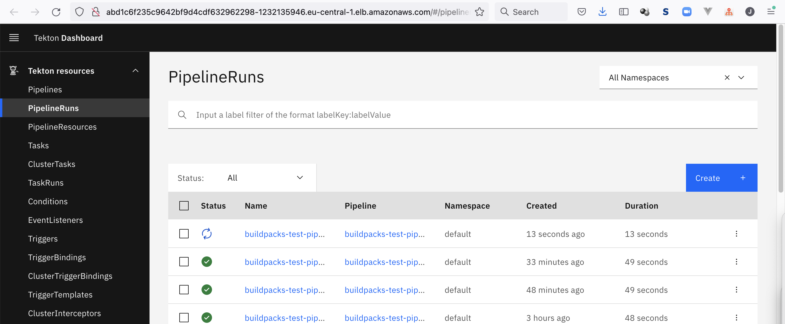


# Report Tekton Pipeline Status back to GitLab 

The last step in our journey of integrating GitLab with Tekton is to report the status of our Tekton Pipelines back to GitLab.

There are multiple options. Let's first start simple using the Tekton Hub task https://hub.tekton.dev/tekton/task/gitlab-set-status


### Install gitlab-set-status Task

Inside our [provision.yml](.github/workflows/provision.yml) workflow we need to install the gitlab-set-status Task:

```shell
kubectl apply -f https://raw.githubusercontent.com/tektoncd/catalog/main/task/gitlab-set-status/0.1/gitlab-set-status.yaml
```


### Create Access Token

To access the GitLab commit API (see https://docs.gitlab.com/ee/api/commits.html#post-the-build-status-to-a-commit) using the `gitlab-set-status` task we need to create an access token as stated in https://docs.gitlab.com/ee/api/index.html#authentication

On self-managed GitLab instances you can create project access tokens for example.

Using gitlab.com we cannot use project access tokens, but can create personal access tokens instead: https://docs.gitlab.com/ee/user/profile/personal_access_tokens.html#create-a-personal-access-token

Therefore head over to __Edit profile__ and choose __Access Tokens__ on the left. Then create a token called `gitlab-api-token` for example:

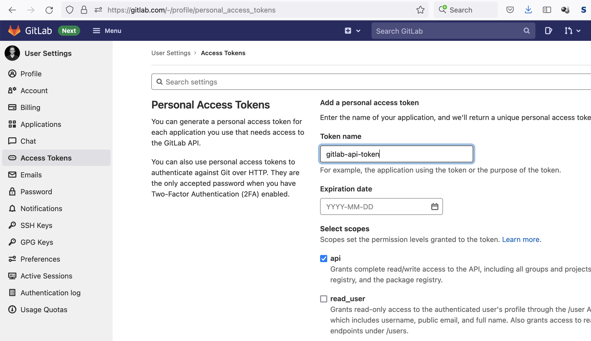

Now since we're using GitHub Actions to provision our EKS cluster and install Tekton, we need to enhance our [provision.yml](.github/workflows/provision.yml) workflow.

First create a new GitHub repository secret `GITLAB_API_TOKEN` containing the personal access token which we just created:


Now we can use these GitHub repo secrets to create the actual Kubernetes secret in our [provision.yml](.github/workflows/provision.yml) workflow:

```yaml
          kubectl create secret generic gitlab-api-secret \
          --from-literal=token=${{ secrets.GITLAB_API_TOKEN }} \
          --namespace default \
          --save-config --dry-run=client -o yaml | kubectl apply -f -
```


### Create task leveraging gitlab-set-status

Using the Tekton Hub task https://hub.tekton.dev/tekton/task/gitlab-set-status we can create a new step inside our [Tekton Pipeline](tekton-ci-config/pipeline.yml). But first ne need to create some new parameters for our Pipeline:

```yaml
  params:
    ...
    - name: REPO_PATH_ONLY
      type: string
      description: GitLab group & repo name only (e.g. jonashackt/microservice-api-spring-boot)
    ...
    - name: GITLAB_HOST
      type: string
      description: Your GitLabs host only (e.g. gitlab.com)
    - name: TEKTON_DASHBOARD_HOST
      type: string
      description: The Tekton dashboard host name only
```

Now we can implement the task:

```yaml
    - name: report-pipeline-end-to-gitlab
      taskRef:
        name: "gitlab-set-status"
      runAfter:
        - buildpacks
      params:
        - name: "STATE"
          value: "success"
        - name: "GITLAB_HOST_URL"
          value: "$(params.GITLAB_HOST)"
        - name: "REPO_FULL_NAME"
          value: "$(params.REPO_PATH_ONLY)"
        - name: "GITLAB_TOKEN_SECRET_NAME"
          value: "gitlab-api-secret"
        - name: "GITLAB_TOKEN_SECRET_KEY"
          value: "token"
        - name: "SHA"
          value: "$(params.SOURCE_REVISION)"
        - name: "TARGET_URL"
          value: "$(params.TEKTON_DASHBOARD_HOST)/#/namespaces/default/pipelineruns/$(context.pipelineRun.name)"
        - name: "CONTEXT"
          value: "tekton-pipeline"
        - name: "DESCRIPTION"
          value: "Finished building your commit in Tekton"
```

First we should make sure this task runs only after the `buildpacks` task using `runAfter`.

Then we need to provide the `GITLAB_HOST_URL` and `REPO_FULL_NAME`.

Also the `GITLAB_TOKEN_SECRET_NAME` needs to refer to the Kubernetes secret `gitlab-api-secret` we created leveraging a Personal Access Token. The `GITLAB_TOKEN_SECRET_KEY` must reference to the `key` name inside the `kubectl create secret` command, where we used `--from-literal=token=${{ secrets.GITLAB_API_TOKEN }}`. So the `GITLAB_TOKEN_SECRET_KEY` is `token` here (which is also the default).

The `TARGET_URL` is a bit more tricky and needs to be crafted with care:

```yaml
        - name: "TARGET_URL"
          value: "$(params.TEKTON_DASHBOARD_HOST)/#/namespaces/default/pipelineruns/$(context.pipelineRun.name)"
```

It consists of the Tekton dashboard host `$(params.TEKTON_DASHBOARD_HOST)` and the Pipeline details prefix `/#/namespaces/default/pipelineruns/`. The `$(context.pipelineRun.name)` finally gives us the current PipelineRun's name we need to be able to reference the actual PipelineRun from the GitLab UI.

Finally the `CONTEXT` and `DESCRIPTION` should contain useful information to be displayed in the GitLab UI later:

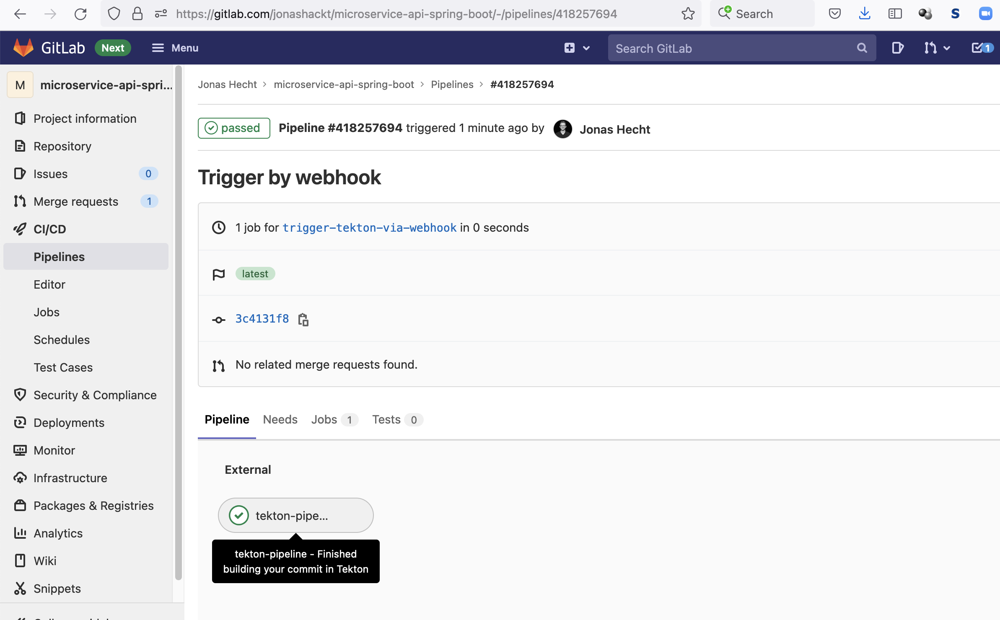


### Add new gitlab-set-status parameters to PipelineRun and EventListener

Our [pipeline-run.yml](tekton-ci-config/pipeline-run.yml) (for manual triggering):

```yaml
...
  params:
    - name: IMAGE
      value: registry.gitlab.com/jonashackt/microservice-api-spring-boot # This defines the name of output image
    - name: SOURCE_URL
      value: https://gitlab.com/jonashackt/microservice-api-spring-boot
    - name: REPO_PATH_ONLY
      value: jonashackt/microservice-api-spring-boot
    - name: SOURCE_REVISION
      value: main
    - name: GITLAB_HOST
      value: gitlab.com
    - name: TEKTON_DASHBOARD_HOST
      value: http://abd1c6f235c9642bf9d4cdf632962298-1232135946.eu-central-1.elb.amazonaws.com
```

and the [EventListener](tekton-ci-config/triggers/gitlab-push-listener.yml) (for automatic triggering by our gitlab.com projects) need to pass some new parameters in order to get the `gitlab-set-status` task working:

```yaml
                params:
                  - name: IMAGE
                    value: "registry.gitlab.com/$(tt.params.gitrepository_pathonly)" #here our GitLab's registry url must be configured
                  - name: SOURCE_URL
                    value: $(tt.params.gitrepositoryurl)
                  - name: REPO_PATH_ONLY
                    value: $(tt.params.gitrepository_pathonly)
                  - name: SOURCE_REVISION
                    value: $(tt.params.gitrevision)
                  - name: GITLAB_HOST
                    value: gitlab.com
                  - name: TEKTON_DASHBOARD_HOST
                    value: {{TEKTON_DASHBOARD_HOST}}
```

Adding the `REPO_PATH_ONLY` is no problem, since we alread used `$(tt.params.gitrepository_pathonly)` inside the `IMAGE` parameter. As with the GitLab registry url we can also "hard code" the `GITLAB_HOST` here for now.

The `TEKTON_DASHBOARD_HOST` is the trickiest part, since we need to substitute this value from outside of the Tekton Trigger process, which doesn't know about the Tekton dashboard url.

But luckily inside our GitHub Actions [provision.yml](.github/workflows/provision.yml) workflow we can use https://stackoverflow.com/questions/48296082/how-to-set-dynamic-values-with-kubernetes-yaml-file/70152914#70152914:

```yaml
          echo "--- Insert Tekton dashboard url into EventListener config and apply it (see https://stackoverflow.com/a/70152914/4964553)"
          TEKTON_DASHBOARD_HOST="${{ steps.dashboard-expose.outputs.dashboard_host }}"
          sed "s#{{TEKTON_DASHBOARD_HOST}}#$TEKTON_DASHBOARD_HOST#g" tekton-ci-config/triggers/gitlab-push-listener.yml | kubectl apply -f -
```

Using sed we simply replace `{{TEKTON_DASHBOARD_HOST}}` with the already defined GitHub Actions variable `${{ steps.dashboard-expose.outputs.dashboard_host }}`.

Testing our full workflow is simple pushing a change to our repo using a branch without GitLab CI: https://gitlab.com/jonashackt/microservice-api-spring-boot/-/commits/trigger-tekton-via-webhook

Now our GitLab Pipelines view gets filled with a Tekton Pipelines status (`success` only for now):

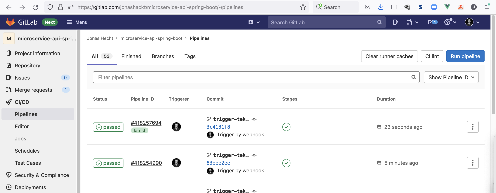


### Reporting `running` status to GitLab

Now that we generally know how to use the `gitlab-set-status` Task, we could also use another Task definition to report the starting of a Tekton Pipeline run to GitLab UI.

Therefore we enhance our [Tekton Pipeline](tekton-ci-config/pipeline.yml) with a new Task starting the whole Pipeline called `report-pipeline-start-to-gitlab`:

```yaml
  tasks:
    - name: report-pipeline-start-to-gitlab
      taskRef:
        name: gitlab-set-status
      params:
        - name: "STATE"
          value: "running"
        - name: "GITLAB_HOST_URL"
          value: "$(params.GITLAB_HOST)"
        - name: "REPO_FULL_NAME"
          value: "$(params.REPO_PATH_ONLY)"
        - name: "GITLAB_TOKEN_SECRET_NAME"
          value: "gitlab-api-secret"
        - name: "GITLAB_TOKEN_SECRET_KEY"
          value: "token"
        - name: "SHA"
          value: "$(params.SOURCE_REVISION)"
        - name: "TARGET_URL"
          value: "$(params.TEKTON_DASHBOARD_HOST)/#/namespaces/default/pipelineruns/$(context.pipelineRun.name)"
        - name: "CONTEXT"
          value: "tekton-pipeline"
        - name: "DESCRIPTION"
          value: "Building your commit in Tekton"
    - name: fetch-repository # This task fetches a repository from github, using the `git-clone` task you installed
      taskRef:
        name: git-clone
      runAfter:
        - report-pipeline-start-to-gitlab
```

And the `fetch-repository` only starts after the status is reported to GitLab. With this new Task in place a push to our repository https://gitlab.com/jonashackt/microservice-api-spring-boot __directly__ presents a `running` Pipeline inside the GitLab UI: 


And in the details view we can directly access our running Tekton Pipeline via a correct Tekton dashboard link:

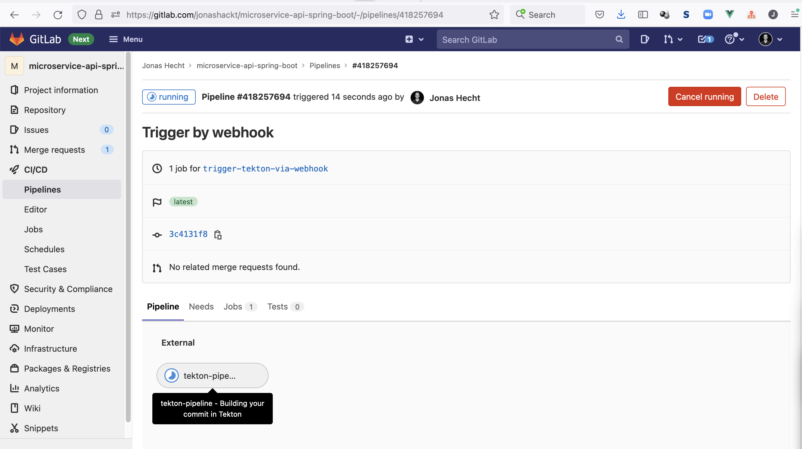


### Reporting `failed` status to GitLab

How do we catch all status from our Tekton pipeline and then report based on that to GitLab?

[In v0.14 Tekton introduced finally Tasks](https://github.com/tektoncd/pipeline/releases/tag/v0.14.0), which run at the end of every PipelineRun - regardless which Task failed or succeeded. [As the docs state](https://tekton.dev/docs/pipelines/pipelines/#adding-finally-to-the-pipeline):

> finally tasks are guaranteed to be executed in parallel after all PipelineTasks under tasks have completed regardless of success or error.

Finally tasks look like this:

```yaml
spec:
  tasks:
    - name: tests
      taskRef:
        name: integration-test
  finally:
    - name: cleanup-test
      taskRef:
        name: cleanup
```

With [Guard[ing] finally Task execution using when expressions](https://tekton.dev/docs/pipelines/pipelines/#guard-finally-task-execution-using-when-expressions) we can enhance this even further.

Because using `when` expressions we can run Tasks based on the overall Pipeline status (or Aggregate Pipeline status) - see https://tekton.dev/docs/pipelines/pipelines/#when-expressions-using-aggregate-execution-status-of-tasks-in-finally-tasks

```yaml
finally:
  - name: notify-any-failure # executed only when one or more tasks fail
    when:
      - input: $(tasks.status)
        operator: in
        values: ["Failed"]
    taskRef:
      name: notify-failure
```

The [Aggregate Execution Status](https://tekton.dev/docs/pipelines/pipelines/#using-aggregate-execution-status-of-all-tasks) we can grap using `$(tasks.status)` is stated to have those 4 possible status:

`Succeeded` ("all tasks have succeeded") or `Completed` ("all tasks completed successfully including one or more skipped tasks"), which could be translated into the `gitlab-set-status` Tasks `STATE` value `success`.

And `Failed` ("one ore more tasks failed") or `None` ("no aggregate execution status available (i.e. none of the above), one or more tasks could be pending/running/cancelled/timedout"), which could both be translated into the `gitlab-set-status` Tasks `STATE` value `failed`. For `None` this is only valid, since we're in a `finally task`, since `pending/running` could otherwise also mean that a Pipeline is in a good state. 

Luckily the `when` expressions

> [values is an array of string values.](https://tekton.dev/docs/pipelines/pipelines/#guard-task-execution-using-when-expressions)

So we're able to do 

```yaml
  when:
    - input: $(tasks.status)
      operator: in
      values: [ "Failed", "None" ]
```

and

```yaml
  when:
    - input: $(tasks.status)
      operator: in
      values: [ "Succeeded", "Completed" ]
```


In the end this results in our [Tekton Pipeline's](tekton-ci-config/pipeline.yml) `finally` block locking like this:

```yaml
...
  finally:
    - name: report-pipeline-failed-to-gitlab
      when:
        - input: $(tasks.status)
          operator: in
          values: [ "Failed", "None" ] # see aggregated status https://tekton.dev/docs/pipelines/pipelines/#using-aggregate-execution-status-of-all-tasks
      taskRef:
        name: "gitlab-set-status"
      params:
        - name: "STATE"
          value: "failed"
        - name: "GITLAB_HOST_URL"
          value: "$(params.GITLAB_HOST)"
        - name: "REPO_FULL_NAME"
          value: "$(params.REPO_PATH_ONLY)"
        - name: "GITLAB_TOKEN_SECRET_NAME"
          value: "gitlab-api-secret"
        - name: "GITLAB_TOKEN_SECRET_KEY"
          value: "token"
        - name: "SHA"
          value: "$(params.SOURCE_REVISION)"
        - name: "TARGET_URL"
          value: "$(params.TEKTON_DASHBOARD_HOST)/#/namespaces/default/pipelineruns/$(context.pipelineRun.name)"
        - name: "CONTEXT"
          value: "tekton-pipeline"
        - name: "DESCRIPTION"
          value: "An error occurred building your commit in Tekton"
    - name: report-pipeline-success-to-gitlab
      when:
          - input: $(tasks.status)
            operator: in
            values: [ "Succeeded", "Completed" ] # see aggregated status https://tekton.dev/docs/pipelines/pipelines/#using-aggregate-execution-status-of-all-tasks
      taskRef:
        name: "gitlab-set-status"
      params:
        - name: "STATE"
          value: "success"
        - name: "GITLAB_HOST_URL"
          value: "$(params.GITLAB_HOST)"
        - name: "REPO_FULL_NAME"
          value: "$(params.REPO_PATH_ONLY)"
        - name: "GITLAB_TOKEN_SECRET_NAME"
          value: "gitlab-api-secret"
        - name: "GITLAB_TOKEN_SECRET_KEY"
          value: "token"
        - name: "SHA"
          value: "$(params.SOURCE_REVISION)"
        - name: "TARGET_URL"
          value: "$(params.TEKTON_DASHBOARD_HOST)/#/namespaces/default/pipelineruns/$(context.pipelineRun.name)"
        - name: "CONTEXT"
          value: "tekton-pipeline"
        - name: "DESCRIPTION"
          value: "Finished building your commit in Tekton"
```

Executing our Tekton Pipeline should now be reported correctly to our GitLab. Failures look like this:

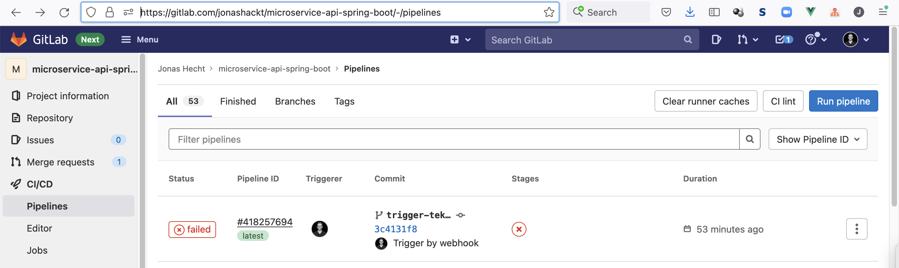

and in the detail view:

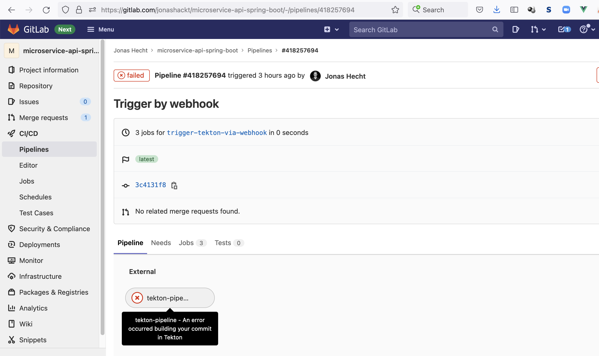

The solution is based on https://stackoverflow.com/questions/70156006/report-tekton-pipeline-status-to-gitlab-regardless-if-pipeline-failed-or-succeed/70156007#70156007.


### Refactoring usage of gitlab-set-status usage

Right now we have a huge pipeline with only 2-3 relevant Tekton tasks, the other 3 Tasks are solely used to communicate the pipeline's status to GitLab.

So is there a way we could refactor these to a more generic form? I digged into `PipelineResources` as I thought they could be a nice option to handle this. But sadly they didn't make it into the Tekton beta: https://tekton.dev/docs/pipelines/migrating-v1alpha1-to-v1beta1/#replacing-pipelineresources-with-tasks

That's why we need another way to accomplish our refactoring. So what about simply using Tasks that reference other Tasks? Sadly that doesn't seem to be possible. Since Tasks only specify `steps` not `tasks` with `taskRef`.


#### Using Pipelines-in-Pipelines

But how about using Pipelines using other Pipelines? Is this possible? Yes, but currently only as experimental: https://tekton.dev/docs/pipelines/pipelines/#compose-using-pipelines-in-pipelines & https://github.com/tektoncd/experimental/blob/main/pipelines-in-pipelines/examples/pipelinerun-with-pipeline-in-pipeline.yaml

As stated we can create a normal Tekton Pipeline as we're already used to - and then use this Pipeline in another Pipeline simply by using `taskRef` with `kind: Pipeline` and `apiVersion: tekton.dev/v1beta1` accompanying the referenced pipeline name:

```yaml
      - name: reference-other-pipeline
        taskRef:
          apiVersion: tekton.dev/v1beta1
          kind: Pipeline
          name: other-pipeline-name
```

In order to be able to use this feature, [we need to install the `Pipelines-In-Pipelines Controller`](https://github.com/tektoncd/experimental/tree/main/pipelines-in-pipelines#install) with (but be aware of https://github.com/tektoncd/experimental/issues/817 which is fixed by https://github.com/tektoncd/experimental/pull/818)

```shell
kubectl apply --filename https://storage.googleapis.com/tekton-releases-nightly/pipelines-in-pipelines/latest/release.yaml
```


#### Enabling Tekton alpha features

Now running our pipelines would result in the following error:

```shell
Pipeline default/buildpacks-test-pipeline can't be Run; it contains Tasks that don't exist: Couldn't retrieve Task "generic-gitlab-set-status": tasks.tekton.dev "generic-gitlab-set-status" not found
```

That's because the Pipeline-in-Pipelines feature is an alpha feature - see this issue https://github.com/tektoncd/experimental/issues/785

In order to activate [Tekton alpha features](https://tekton.dev/docs/pipelines/install/#alpha-features) we need to [Customize the Pipeline Controllers behavior](https://tekton.dev/docs/pipelines/install/#customizing-the-pipelines-controller-behavior).

As stated in https://stackoverflow.com/a/70336211/4964553 this could be done on-the-fly with `curl` and `sed` piped into `kubectl apply` like this:

```shell
curl https://storage.googleapis.com/tekton-releases/pipeline/latest/release.yaml | sed "s#stable#alpha#g" | kubectl apply -f -
```


#### Create a generic gitlab-set-status pipeline for later re-use

Let's try to create a generic Tekton Pipeline for the `gitlab-set-status` as [generic-gitlab-set-status.yml](tekton-ci-config/generic-gitlab-set-status.yml):

```yaml
apiVersion: tekton.dev/v1beta1
kind: Pipeline
metadata:
  name: generic-gitlab-set-status
spec:
  params:
    - name: STATE
      type: string
      description: The gitlab-set-status Tasks state to set. Can be one of the following pending, running, success, failed, or canceled.
    - name: PIPELINE_NAME
      type: string
      description: The calling pipelines name.
    - name: REPO_PATH_ONLY
      type: string
      description: GitLab group & repo name only (e.g. jonashackt/microservice-api-spring-boot)
    - name: SOURCE_REVISION
      description: The branch, tag or SHA to checkout.
      default: ""
    - name: GITLAB_TOOLTIP
      type: string
      description: The tooltip to be shown in the GitLab Pipelines details view.

  tasks:
    - name: report-pipeline-start-to-gitlab
      taskRef:
        name: gitlab-set-status
      params:
        - name: "STATE"
          value: "$(params.STATE)"
        - name: "GITLAB_HOST_URL"
          value: "gitlab.com"
        - name: "REPO_FULL_NAME"
          value: "$(params.REPO_PATH_ONLY)"
        - name: "GITLAB_TOKEN_SECRET_NAME"
          value: "gitlab-api-secret"
        - name: "GITLAB_TOKEN_SECRET_KEY"
          value: "token"
        - name: "SHA"
          value: "$(params.SOURCE_REVISION)"
        - name: "TARGET_URL"
          value: "{{TEKTON_DASHBOARD_HOST}}/#/namespaces/default/pipelineruns/$(params.PIPELINE_NAME)"
        - name: "CONTEXT"
          value: "tekton-pipeline"
        - name: "DESCRIPTION"
          value: "$(params.GITLAB_TOOLTIP)"
```

As you can see we define the `TEKTON_DASHBOARD_HOST` using brackets so we can later use `sed` to dynamically set the actual Tekton Dashboard URL in our GitHub Actions pipeline (using `sed` for this is also described in https://stackoverflow.com/a/70152914/4964553)

```shell
TEKTON_DASHBOARD_HOST="${{ steps.dashboard-expose.outputs.dashboard_host }}"
sed "s#{{TEKTON_DASHBOARD_HOST}}#$TEKTON_DASHBOARD_HOST#g" tekton-ci-config/generic-gitlab-set-status.yml | kubectl apply -f -
```


#### Use the generic gitlab-set-status pipeline in our actual pipeline

In our [pipeline.yml](tekton-ci-config/pipeline.yml) we can now reduce many lines that we don't need to pass to the generic gitlab-set-status pipeline any more. So our pipeline becomes much more readable and only the things remain that are naturally defined inside a pipeline. See the usage of our generic gitlab-set-status pipeline here using the Pipelines-in-Pipelines feature: 

```yaml
    - name: report-pipeline-start-to-gitlab
      taskRef:
        apiVersion: tekton.dev/v1beta1
        kind: Pipeline
        name: generic-gitlab-set-status
      params:
        - name: "STATE"
          value: "running"
        - name: "REPO_PATH_ONLY"
          value: "$(params.REPO_PATH_ONLY)"
        - name: "SHA"
          value: "$(params.SOURCE_REVISION)"
        - name: "GITLAB_TOOLTIP"
          value: "Building your commit in Tekton"
        - name: "PIPELINE_NAME"
          value: "$(context.pipelineRun.name)"
```

As the Pipeline-in-Pipeline feature is in alpha state, this is really cool to see it working. In a future version there might be the option to also remove the `PIPELINE_NAME` parameter (but currently I see no option for that https://github.com/tektoncd/experimental/tree/main/pipelines-in-pipelines).  

The code needed to invoke the gitlab-set-status task is reduced all the way:

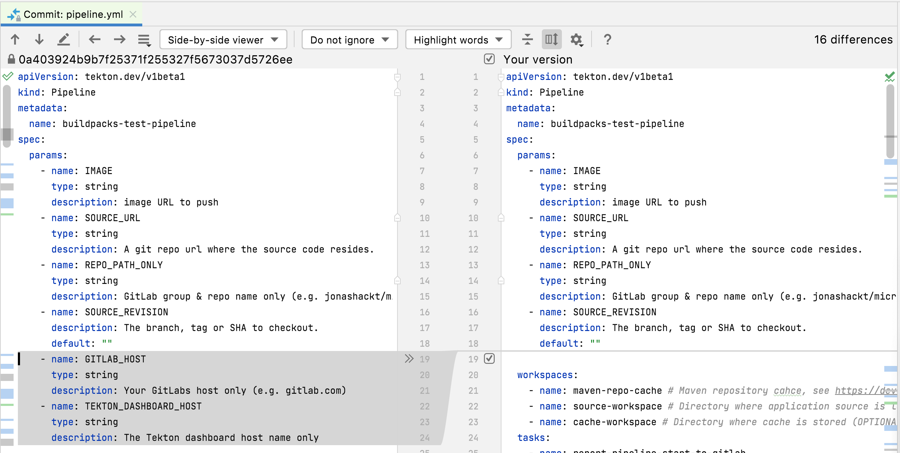

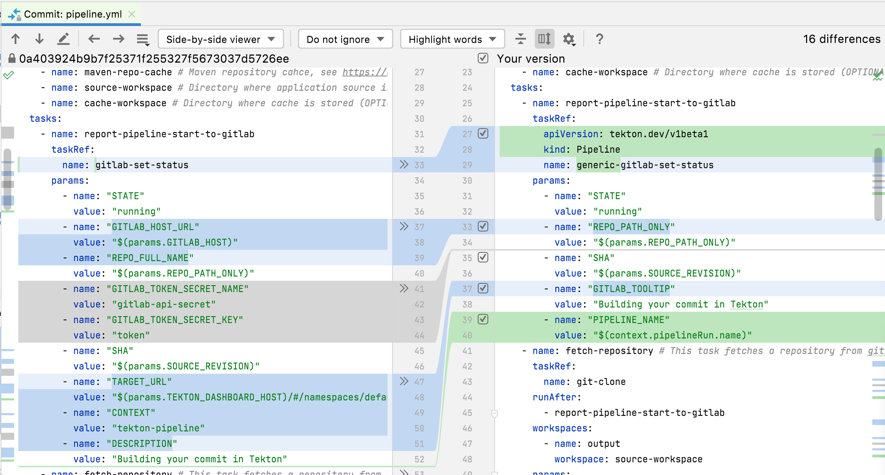

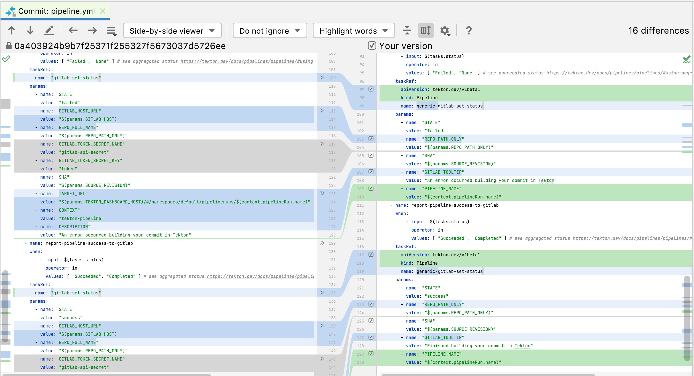

Finally we can also __remove code__ from our [pipeline-run.yml](tekton-ci-config/pipeline-run.yml) and [gitlab-push-listener.yml](tekton-ci-config/triggers/gitlab-push-listener.yml):

```yaml
    - name: GITLAB_HOST
      value: gitlab.com
    - name: TEKTON_DASHBOARD_HOST
      value: {{TEKTON_DASHBOARD_HOST}}
```

because this is now centrally configured in our generic pipeline :)

There's maybe one thing that could be considered as downside: One logic pipeline now triggers 3 PipelineRuns - those are also shown in the Tekton Dashboard:

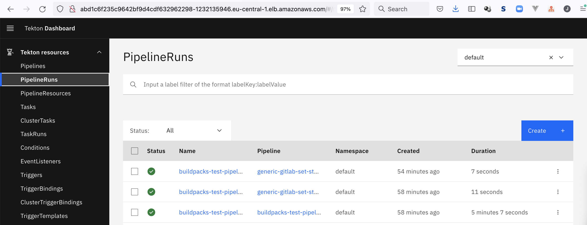


# Q & A

### Pod gives message: '0/2 nodes are available: 2 node(s) had volume node affinity conflict.'

The Tekton pipeline failed and I had to dig into the Pod logs to find the error ([see this log](http://abd1c6f235c9642bf9d4cdf632962298-1232135946.eu-central-1.elb.amazonaws.com/#/namespaces/default/pipelineruns/buildpacks-test-pipeline-run-mdbh5?pipelineTask=fetch-repository&view=pod)):

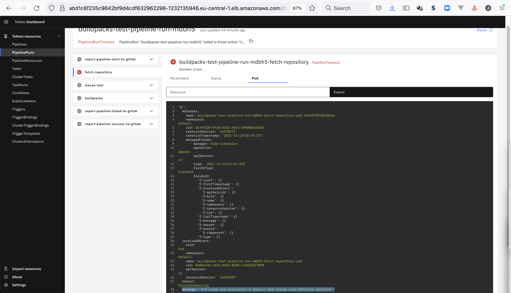

As described in https://stackoverflow.com/a/55514852/4964553 and the section `Statefull applications` in https://vorozhko.net/120-days-of-aws-eks-kubernetes-in-staging to nodes are provisioned on other AWS availability zones as the persistent volume (PV), which is created by applying our PersistendVolumeClaim in [resources.yml](tekton-ci-config/resources.yml).

To double check that, you need to look into/describe your nodes:

```shell
k get nodes
NAME                                             STATUS   ROLES    AGE     VERSION
ip-172-31-10-186.eu-central-1.compute.internal   Ready    <none>   2d16h   v1.21.5-eks-bc4871b
ip-172-31-20-83.eu-central-1.compute.internal    Ready    <none>   2d16h   v1.21.5-eks-bc4871b
```

and have a look at the `Label` section:

```shell
$ k describe node ip-172-77-88-99.eu-central-1.compute.internal
Name:               ip-172-77-88-99.eu-central-1.compute.internal
Roles:              <none>
Labels:             beta.kubernetes.io/arch=amd64
                    beta.kubernetes.io/instance-type=t2.medium
                    beta.kubernetes.io/os=linux
                    failure-domain.beta.kubernetes.io/region=eu-central-1
                    failure-domain.beta.kubernetes.io/zone=eu-central-1b
                    kubernetes.io/arch=amd64
                    kubernetes.io/hostname=ip-172-77-88-99.eu-central-1.compute.internal
                    kubernetes.io/os=linux
                    node.kubernetes.io/instance-type=t2.medium
                    topology.kubernetes.io/region=eu-central-1
                    topology.kubernetes.io/zone=eu-central-1b
Annotations:        node.alpha.kubernetes.io/ttl: 0
...
```

In my case the node `ip-172-77-88-99.eu-central-1.compute.internal` has `failure-domain.beta.kubernetes.io/region` defined as `eu-central-1` and the az with `failure-domain.beta.kubernetes.io/zone` to `eu-central-1b``

And the other node defines az `eu-central-1a`:

```shell
$ k describe nodes ip-172-31-10-186.eu-central-1.compute.internal
Name:               ip-172-31-10-186.eu-central-1.compute.internal
Roles:              <none>
Labels:             beta.kubernetes.io/arch=amd64
                    beta.kubernetes.io/instance-type=t2.medium
                    beta.kubernetes.io/os=linux
                    failure-domain.beta.kubernetes.io/region=eu-central-1
                    failure-domain.beta.kubernetes.io/zone=eu-central-1a
                    kubernetes.io/arch=amd64
                    kubernetes.io/hostname=ip-172-31-10-186.eu-central-1.compute.internal
                    kubernetes.io/os=linux
                    node.kubernetes.io/instance-type=t2.medium
                    topology.kubernetes.io/region=eu-central-1
                    topology.kubernetes.io/zone=eu-central-1a
Annotations:        node.alpha.kubernetes.io/ttl: 0
...
```

Now looking into our `PersistentVolume` automatically provisioned after applying our `PersistentVolumeClaim` with [resources.yml](tekton-ci-config/resources.yml), we see the problem already:

```shell
$ k get pv
NAME                                       CAPACITY   ACCESS MODES   RECLAIM POLICY   STATUS   CLAIM                           STORAGECLASS   REASON   AGE
pvc-93650993-6154-4bd0-bd1c-6260e7df49d3   1Gi        RWO            Delete           Bound    default/buildpacks-source-pvc   gp2                     21d

$ k describe pv pvc-93650993-6154-4bd0-bd1c-6260e7df49d3
Name:              pvc-93650993-6154-4bd0-bd1c-6260e7df49d3
Labels:            topology.kubernetes.io/region=eu-central-1
                   topology.kubernetes.io/zone=eu-central-1c
Annotations:       kubernetes.io/createdby: aws-ebs-dynamic-provisioner
...
```

The `PersistentVolume` was provisioned to `topology.kubernetes.io/zone` in az `eu-central-1c`, which makes our Pods complain about not finding their volume - since they are in a completely different az.

As [stated in the Kubernetes docs](https://kubernetes.io/docs/concepts/storage/storage-classes/#allowed-topologies) one solution to the problem is to add a `allowedTopologies` configuration like this:

```yaml
apiVersion: storage.k8s.io/v1
kind: StorageClass
metadata:
  name: gp2
parameters:
  fsType: ext4
  type: gp2
provisioner: kubernetes.io/aws-ebs
reclaimPolicy: Delete
volumeBindingMode: WaitForFirstConsumer
allowedTopologies:
- matchLabelExpressions:
  - key: failure-domain.beta.kubernetes.io/zone
    values:
    - eu-central-1a
    - eu-central-1b
```

(if you already provisioned a EKS cluster like me, get your already defined `StorageClass` with `k get storageclasses gp2 -o yaml` and add the `allowedTopologies` configuration)

As you see the `allowedTopologies` configuration defines that the `failure-domain.beta.kubernetes.io/zone` of the `PersistentVolume` must be either in `eu-central-1a` or `eu-central-1b` - not `eu-central-1c`!

Next apply this `StorageClass` and delete the `PersistentVolumeClaim`. Now add `storageClassName: gp2` to the PersistendVolumeClaim definition in [resources.yml](tekton-ci-config/resources.yml):

```yaml
apiVersion: v1
kind: PersistentVolumeClaim
metadata:
  name: buildpacks-source-pvc
spec:
  accessModes:
    - ReadWriteOnce
  resources:
    requests:
      storage: 500Mi
  storageClassName: gp2
```

and then re-applying it will resolve the problem.


# Ideas

https://hub.tekton.dev/tekton/task/create-gitlab-release

### GitLab and Tekton

https://gitlab.com/gitlab-org/gitlab/-/issues/213360

https://gitlab.com/gitlab-org/gitlab-runner/-/issues/28051 

https://gitlab.com/gitlab-com/marketing/community-relations/opensource-program/consortium-memberships/-/issues/19

https://www.youtube.com/watch?v=skcLi9-WTkA

https://cloud.google.com/tekton

https://www.reddit.com/r/kubernetes/comments/p0x9cv/what_is_tekton_and_how_it_compares_to_jenkins/h89tyxb/

### ChatOps with Bots

Why not use a Chat bot to do the job?

-> If I push, a bot asks me to assign another person for the pull request

#### prow

- see Kubernetes github project: prow comments on every pull request

https://archive.fosdem.org/2021/schedule/event/ci_on_gitlab_ringing_gitlab_tekton_and_prow_together/

prow is GitHub specific, so what's the alternative?

> rather than being GitHub specific Lighthouse uses jenkins-x/go-scm so it can support any Git provider (while Lighthouse reuses the Prow plugin source code and a bunch of plugins from Prow)

#### Jenkins X lighthouse

https://jenkins-x.io/v3/about/what/#chatops

> With the ever growing number of microservices needing automation, Jenkins X provides the ability to interact with pipelines via comments on pull requests. Lighthouse has evolved from Prow which is used heavily in the Kubernetes ecosystem to provide a consistent developer workflow for triggering tests, approvals, hold and other common commands developers use in their everyday activities

https://github.com/jenkins-x/lighthouse

> Lighthouse is a lightweight ChatOps based webhook handler which can trigger Jenkins X Pipelines, Tekton Pipelines or Jenkins Jobs based on webhooks from multiple git providers such as GitHub, GitHub Enterprise, BitBucket Server and GitLab.


#### Lighthouse Tekton Integration with GitLab

https://github.com/jenkins-x/lighthouse/blob/main/docs/install_lighthouse_with_tekton.md

lighthouse-foghorn: watches execution of Tekton `PipelineRun` triggered by lighthouse and updates AND BLOCKS pull requests from beeing merged until Tekton pipelines succeeded

And more:

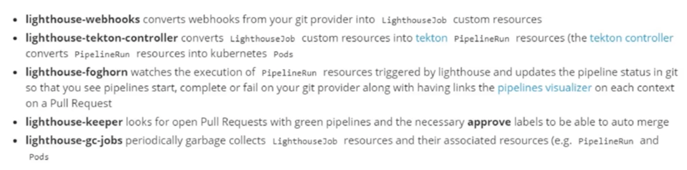

--> Lighthouse Tekton integration misses JSON-payload proceeding to Tekton Pipelines/Tasks!


## Tekton Triggers

GitLab Webhooks --> trigger Tekton Triggers

https://github.com/tektoncd/triggers


#### No GUI info

https://github.com/tektoncd/experimental/tree/main/commit-status-tracker


#### Deploy AWS Load Balancer Controller

> The AWS ALB Ingress Controller has been rebranded to AWS Load Balancer Controller.

https://aws.amazon.com/blogs/opensource/kubernetes-ingress-aws-alb-ingress-controller/

Pulumi AWS Load Balancer Controller support: https://github.com/pulumi/pulumi-eks/issues/29

https://pulumi.awsworkshop.io/50_eks_platform/30_deploy_ingress_controller.html


#### Deploy your own Tekton Hub instance

https://github.com/tektoncd/hub#deploy-your-own-instance

> You can deploy your own instance of Tekton Hub. You can find the documentation https://github.com/tektoncd/hub/blob/main/docs/DEPLOYMENT.md